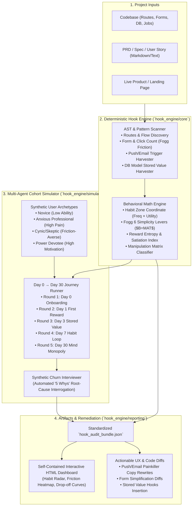

# Nir Eyal Hook Model Engine ("HookEngine"): Architecture & Implementation Plan

> **System Purpose:** An end-to-end behavioral audit, simulation, and remediation engine that evaluates software projects (codebases, user flows, PRDs, and live products) against **Nir Eyal's Hook Model** (*Trigger, Action, Variable Reward, Investment*). 
> Packaged for developers and product designers as an open-standard **Claude / Codex / Cursor / Antigravity Skill** and a **standalone Python CLI tool**.

---

## 1. System Philosophy & Design Principles (Lazy Senior Dev / Ponytail Standard)

1. **Zero Fragile Cloud Dependencies (YAGNI & Autonomy)**:
   * Unlike MiroFish which relies heavily on Zep Cloud and multi-container Docker runtimes, HookEngine runs locally using Python standard libraries (`dataclasses`, `sqlite3`, `re`, `json`, `pathlib`, `argparse`).
   * Runs natively in any Claude Code, Cursor, Antigravity, or CI/CD environment with zero required API keys. When an LLM API key or active AI Agent is present, it augments the analysis with deep qualitative cohort interviews and automated code diffs.

2. **Deterministic Linters Before Stochastic Guesses**:
   * Pure LLM prompts hallucinate and drift. HookEngine uses a deterministic AST and pattern scanner to extract concrete codebase metrics:
     * Number of form inputs and clicks before first reward (Fogg Ability friction).
     * External trigger implementations (cron workers, email templates, push notifications).
     * Stored value schemas (database models, user-generated content, follower graphs).
   * Multi-agent simulation is applied only where emergent human behavior matters: simulating user lifecycle drop-off across Day 0, Day 1, Day 3, Day 7, and Day 30.

3. **Progressive Disclosure (`agentskills.io` standard)**:
   * `SKILL.md` operates as a concise orchestrator (< 500 lines).
   * Deep psychological heuristics, matrices, and rubrics are modularized in `references/*.md` and loaded only on demand to preserve context window tokens.
   * Every audit produces a validated, machine-readable `hook_audit_bundle.json` before rendering human-facing HTML dashboards and code patches.

---

## 2. End-to-End System Architecture



---

## 3. Core Behavioral Domain Model

| Hook Phase | Core Dimension | Evaluated Metrics | Failure Modes (Antipatterns) |
| :--- | :--- | :--- | :--- |
| **Phase 1: Trigger** | External $\rightarrow$ Internal | • External Trigger Type: Paid, Earned, Relationship, Owned.<br/>• Internal Itch Alignment: Boredom, Loneliness, Uncertainty, Anxiety, FOMO.<br/>• Trigger Timing: Is prompt delivered when user has ability to act? | • Spamming owned notifications with generic feature marketing.<br/>• Disconnection between external prompt and root emotional itch.<br/>• Relying permanently on paid triggers without owned hook. |
| **Phase 2: Action** | Simplicity Sieve ($B = MAT$) | • 6 Simplicity Levers: Time, Money, Physical Effort, Mental Effort (Cognitive Load), Social Deviance, Routine Disruption.<br/>• Form inputs count, required clicks, cognitive decision gates before value. | • High-friction registration wall before showing product value.<br/>• Asking for sensitive data (bank/credit card) too early.<br/>• Ambiguous next step (violating Hick's Law). |
| **Phase 3: Variable Reward** | Dopamine & Nucleus Accumbens | • 3 Reward Classes: **Tribe** (social validation), **Hunt** (novelty/deals), **Self** (mastery/completion).<br/>• **Reward Entropy**: Finite vs. Infinite variability.<br/>• Autonomy check: Does user retain locus of control? | • Finite reward fatigue (boring badges, static points).<br/>• Empty state on first session (no initial reward).<br/>• Reactance induction (feeling manipulated or trapped). |
| **Phase 4: Investment** | Stored Value & IKEA Effect | • 5 Stored Value Types: **Content**, **Data**, **Followers**, **Reputation**, **Skill**.<br/>• Does investment load the next external trigger?<br/>• Escalation of commitment curve: Micro-investments only *after* reward. | • Asking for heavy investment upfront before reward.<br/>• Transient usage without accumulated stored value (zero switching costs).<br/>• Dead-end loops (investment does not prime next trigger). |
| **Ethics: Matrix** | The Manipulation Matrix | • **Facilitator**: Maker uses it + materially improves life.<br/>• **Peddler**: Maker doesn't use it + claims it improves life.<br/>• **Entertainer**: Maker uses it + ephemeral enjoyment (no lasting harm).<br/>• **Dealer**: Compulsive use + material harm (Addiction/Sludge). | • Dark patterns: Roach motels, hidden billing, confirmshaming.<br/>• Exploiting vulnerable populations with gambling/infinite loops. |

---

## 4. Repository Structure

```
nir-eyal-hooked ideology/
├── .gitignore
├── ARCHITECTURE_PLAN.md               # Master technical specification
├── README.md                          # Public GitHub README (Installation, Skill usage, CLI)
├── hook_engine/                       # Core Python package (Zero external cloud dependencies)
│   ├── __init__.py
│   ├── cli.py                         # Unified CLI runner (audit, simulate, diff)
│   ├── core/
│   │   ├── __init__.py
│   │   ├── models.py                  # Dataclasses: HookGraph, Finding, AuditBundle, Cohort
│   │   ├── scanner.py                 # Codebase AST & filesystem parser (routes, forms, DB, crons)
│   │   └── scorer.py                  # Habit Zone, Fogg Friction, Reward Entropy, Matrix scoring
│   ├── simulation/
│   │   ├── __init__.py
│   │   ├── cohorts.py                 # Psychographic user archetypes & behavior curves
│   │   ├── lifecycle.py               # Day 0 to Day 30 lifecycle journey simulator
│   │   └── interviewer.py             # Autonomous '5 Whys' synthetic churn interrogation
│   └── reporting/
│       ├── __init__.py
│       ├── builder.py                 # Normalizes findings into hook_audit_bundle.json
│       ├── html_generator.py          # Standalone interactive HTML report dashboard
│       └── patch_generator.py         # Code and copy remediation diff generator
├── skills/
│   └── hooked/                        # Claude / Codex / Antigravity standard skill package
│       ├── SKILL.md                   # agentskills.io YAML metadata & agent execution contract
│       ├── references/                # Modular deep-dive knowledge sheets
│       │   ├── 01_habit_zone.md
│       │   ├── 02_trigger_rubric.md
│       │   ├── 03_action_fogg_sieves.md
│       │   ├── 04_variable_rewards.md
│       │   ├── 05_stored_value_types.md
│       │   ├── 06_manipulation_matrix.md
│       │   └── 07_builder_playbook.md
│       └── templates/
│           ├── hook_audit_bundle.schema.json
│           └── sample_audit_bundle.json
├── tests/                             # Runnable assert tests (no heavy testing frameworks needed)
│   ├── test_scanner.py
│   ├── test_scorer.py
│   ├── test_simulation.py
│   ├── test_reporting.py
│   └── test_e2e.py
├── chapters/                          # Source book reference chapters
├── ideology/                          # Core ideological foundations
└── assets/                            # Visual artifacts and figures
```

---

## 5. Phased Implementation Plan & Verification Gates

### Phase 1: Engine Core (`hook_engine/core/`)
* [x] **Models**: Define typed dataclasses for `Trigger`, `Action`, `VariableReward`, `Investment`, `Finding`, `AuditBundle`.
* [x] **Scanner**: Implement filesystem & regex/AST scanner for Next.js, React, Vue, Svelte, Django, Rails, Flutter, Express, FastAPI.
  * Extract route paths, count input fields in form components, detect push/email keywords, extract DB models.
* [x] **Scorer**: Implement formulas for Habit Zone coordinates, Fogg Simplicity Index, Reward Entropy score, and Manipulation Matrix categorization.
* [x] **Verification Gate 1**: Run `tests/test_scanner.py` and `tests/test_scorer.py`.

### Phase 2: Cohort Simulation Engine (`hook_engine/simulation/`)
* [x] **Cohorts**: Define archetypes (`Novice`, `Anxious Worker`, `Skeptic`, `Power Devotee`) with quantitative parameters (Motivation $M \in [0, 1]$, Ability $A \in [0, 1]$, Friction sensitivity, Emotional itches).
* [x] **Lifecycle Runner**: Simulate state transitions across rounds (Day 0, Day 1, Day 3, Day 7, Day 30). Calculate dropout probability per round using $P(\text{Drop}) = 1 - \sigma(M \cdot A - \text{Friction})$.
* [x] **Synthetic Interviewer**: Generate recursive "5 Whys" interview transcripts explaining root causes of churn.
* [x] **Verification Gate 2**: Run `tests/test_simulation.py`.

### Phase 3: Reporting & Remediation (`hook_engine/reporting/`)
* [x] **Audit Bundle Builder**: Validate JSON integrity, calculate aggregate health scores, format findings with control IDs.
* [x] **Interactive HTML Dashboard**: Generate self-contained HTML containing:
  * Executive Habit Health Gauge (0-100).
  * Habit Zone Cartesian plot ($x = \text{Utility}, y = \text{Frequency}$).
  * The 4 Hook Phases audit breakdown cards.
  * User cohort retention waterfall chart.
  * The Manipulation Matrix radar.
* [x] **Code & Copy Patch Generator**: Formulate actionable code diffs and copy revisions.
* [x] **Verification Gate 3**: Run `tests/test_reporting.py`.

### Phase 4: Skill Packaging (`skills/hooked/`)
* [x] **`SKILL.md`**: Create compliant skill file with pushy trigger keywords (`/hooked`, `habit audit`, `hook model`, `retention analysis`).
* [x] **References**: Distill the book's frameworks into 7 modular, token-lean markdown guides in `skills/hooked/references/`.
* [x] **Template & Schemas**: Create JSON schema and sample audit outputs.
* [x] **Verification Gate 4**: Validate skill schema and ensure progressive disclosure links function cleanly.

### Phase 5: CLI, E2E Integration & GitHub Readme
* [x] **CLI Entrypoint**: `hook_engine/cli.py` with `audit`, `simulate`, `scan`, `diff` commands.
* [x] **E2E Integration Test**: Run full audit against synthetic sample projects.
* [x] **Master `README.md`**: Transform top-level README into a world-class open-source project page with quickstart, badges, Claude/Cursor/Antigravity installation instructions, and architecture diagrams.
* [x] **Git Commits**: Commit each major checkpoint cleanly.
