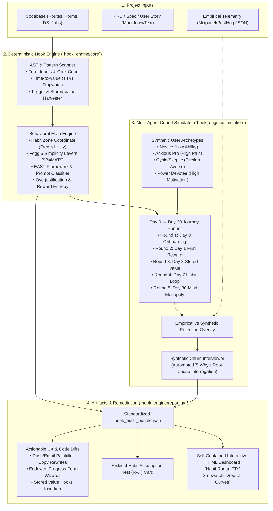

# Nir Eyal Hook Model Engine ("HookEngine"): Architecture & Implementation Plan

> **System Purpose:** An end-to-end behavioral audit, simulation, and remediation engine that evaluates software projects (codebases, user flows, PRDs, and live products) against **Nir Eyal's Hook Model** (*Trigger, Action, Variable Reward, Investment*). 
> Packaged for developers and product designers as an open-standard **Claude / Codex / Cursor / Antigravity Skill** and a **standalone Python CLI tool**.

---

## 1. System Philosophy & Design Principles (Lazy Senior Dev / Ponytail Standard)

1. **Zero Fragile Cloud Dependencies (YAGNI & Autonomy)**:
   * Unlike MiroFish which relies heavily on Zep Cloud and multi-container Docker runtimes, HookEngine runs locally using Python standard libraries (`dataclasses`, `sqlite3`, `re`, `json`, `pathlib`, `argparse`).
   * Runs natively in any Claude Code, Cursor, Antigravity, or CI/CD environment with zero required API keys. When an LLM API key or active AI Agent is present, it augments the analysis with deep qualitative cohort interviews and automated code diffs.

2. **Deterministic Linters Before Stochastic Guesses**:
   * Pure LLM prompts hallucinate and drift. HookEngine uses a deterministic AST and pattern scanner to extract concrete codebase metrics:
     * Number of form inputs and clicks before first reward (Fogg Ability friction).
     * External trigger implementations (cron workers, email templates, push notifications).
     * Stored value schemas (database models, user-generated content, follower graphs).
   * Multi-agent simulation is applied only where emergent human behavior matters: simulating user lifecycle drop-off across Day 0, Day 1, Day 3, Day 7, and Day 30.

3. **Battle-Tested Integrations Inspired by Proven GitHub Skills**:
   * **EAST Framework & Prompt Typing** (*from `coreyhaines31/marketingskills` & `flpbalada/fb-skills`*): Rates Easy, Attractive, Social, Timely, and classifies triggers into Spark, Facilitator, or Signal.
   * **Time-to-Value (TTV) Stopwatch** (*from `marketingskills/onboarding`*): Quantifies estimated seconds to user Aha! moment.
   * **Overjustification Risk Detection** (*from `wondelai/skills`*): Flags when superficial extrinsic rewards crowd out intrinsic desire.
   * **Endowed Progress Wizard Patches** (*from `rampstackco/claude-skills`*): Generates progressive disclosure UI diffs with step 1 pre-checked.
   * **Riskiest Habit Assumption Testing (RAT)** (*from `deanpeters/Product-Manager-Skills`*): Formulates the single highest-risk behavioral assumption.
   * **Empirical Telemetry Ingestion** (*from `claude-skills/product-team`*): Allows ingesting real Mixpanel/PostHog cohort JSON to compare actual vs. simulated retention.

4. **Progressive Disclosure (`agentskills.io` standard)**:
   * `SKILL.md` operates as a concise orchestrator (< 500 lines).
   * Deep psychological heuristics, matrices, and rubrics are modularized in `references/*.md` and loaded only on demand to preserve context window tokens.
   * Every audit produces a validated, machine-readable `hook_audit_bundle.json` before rendering human-facing HTML dashboards and code patches.

---

## 2. End-to-End System Architecture

---

## 3. Phased Implementation Roadmap & Verification Gates

### Phase 1: Core Models & Scanner Enhancements
* [x] Add `PromptType` (Spark, Facilitator, Signal) and `EASTScore` (Easy, Attractive, Social, Timely) to `models.py`.
* [x] Add `TTVMetrics` (estimated Time-to-Value in seconds, friction rating) to `models.py`.
* [x] Add `RATAssumption` (Riskiest Habit Assumption Test) to `models.py`.
* [x] Upgrade `scanner.py` to calculate deterministic TTV seconds and detect EAST cues.
* [x] Upgrade `scorer.py` to evaluate EAST scores, prompt types, and overjustification risk.
* [x] Verify via unit tests in `tests/test_scanner.py` and `tests/test_scorer.py`.
* [x] **Git Checkpoint 1**: `feat(core): add EAST scoring, TTV stopwatch, and prompt categorization`.

### Phase 2: Simulation & Empirical Telemetry Ingestion
* [x] Upgrade `lifecycle.py` to accept optional empirical telemetry retention data (`--telemetry`) and compute discrepancy metrics.
* [x] Upgrade `interviewer.py` to include TTV friction in the 5 Whys dialogue.
* [x] Verify via unit tests in `tests/test_simulation.py`.
* [x] **Git Checkpoint 2**: `feat(simulation): add empirical telemetry ingestion and TTV churn interrogation`.

### Phase 3: Reporting, Endowed Progress Patches & HTML Dashboard
* [x] Upgrade `patch_generator.py` to produce Endowed Progress multi-step wizard diffs (from `rampstackco`).
* [x] Upgrade `builder.py` to synthesize RAT assumptions and EAST scores into `hook_audit_bundle.json`.
* [x] Upgrade `html_generator.py` to display TTV Stopwatch badge, EAST radar, and RAT card.
* [x] Add `skills/hooked/references/08_east_and_ttv_framework.md`.
* [x] Verify via unit tests in `tests/test_reporting.py`.
* [x] **Git Checkpoint 3**: `feat(reporting): add endowed progress patches, TTV dashboard widgets, and EAST references`.

### Phase 4: CLI Runner, E2E Tests & GitHub Documentation
* [x] Upgrade `cli.py` to support `--telemetry <path.json>`.
* [x] Upgrade `tests/test_e2e.py` to test full audit with telemetry and TTV metrics.
* [x] Update `README.md` with complete documentation, CLI guides, and skill installation.
* [x] Sync updated skill to `~/.gemini/config/skills/hooked/`.
* [x] **Git Checkpoint 4**: `feat(cli): add telemetry CLI flag, comprehensive E2E tests, and documentation`.
