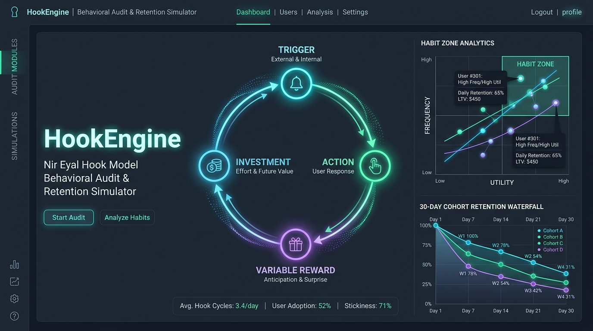
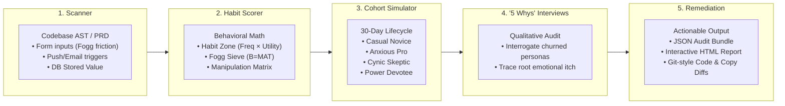

# HookEngine: Nir Eyal Hook Model Behavioral Audit & Simulation Engine

<div align="center">



[](https://github.com/hrkdas/nir-eyal-hooked/actions/workflows/ci.yml)
[](https://www.python.org/downloads/)
[](https://agentskills.io)
[](https://docs.anthropic.com/en/docs/agents-and-tools/claude-code)
[](https://antigravity.google)
[](LICENSE)

**An autonomous behavioral audit, cohort simulation, and UX remediation engine grounded in Nir Eyal's *Hooked*.**  
*Built for founders, product engineers, and AI coding agents (Claude, Codex, Cursor, Antigravity).*

</div>

---

## ⚡ Overview

Why do 79% of smartphone owners check their phones within 15 minutes of waking up? Why do products like Slack, Instagram, Google, and Duolingo become reflexive subconscious daily habits, while 95% of new apps churn into the graveyard within 30 days?

**HookEngine** is an open-source behavioral intelligence platform and AI agent skill. It scans your codebase, PRD, or user flows to evaluate your product against **Nir Eyal's 4-Phase Hook Model** (*Trigger, Action, Variable Reward, Investment*). 

Unlike academic prompt collections or cloud-heavy multi-container simulators, HookEngine is **zero-dependency, standard-library first, and 100% offline-capable**. It provides:

1. **Deterministic AST Codebase Scanner**: Analyzes form fields, click steps, push/email hooks, and DB schemas.
2. **Behavioral Habit Math**: Computes the **Habit Zone Coordinate** ($x = \text{Utility}, y = \text{Frequency}$), **Fogg Simplicity Index** ($B = MAT$), and **Reward Entropy** (Finite vs. Infinite variability).
3. **Multi-Agent 30-Day Cohort Simulator**: Simulates 5 distinct user psychographics navigating your product over 30 days.
4. **Synthetic "5 Whys" Churn Interrogations**: Autonomous qualitative interviews with churned personas diagnosing why they left.
5. **Interactive HTML Dashboard & Git Diffs**: Self-contained visual reports with habit radar graphs, retention waterfalls, and actionable copy/code patches.

---

## 🔄 The 5-Phase Behavioral Engine



---

## 🚀 Quickstart

### 1. Install

**Option A — Clone & run directly** (no install needed):
```bash
git clone https://github.com/hrkdas/nir-eyal-hooked.git
cd nir-eyal-hooked

# Run via the bin wrapper (works on macOS Homebrew Python without venv)
./bin/hook-engine audit ./my-app --html report.html
```

**Option B — pip install** (recommended for global CLI access):
```bash
git clone https://github.com/hrkdas/nir-eyal-hooked.git
cd nir-eyal-hooked
pip install .          # or: pip install -e . (editable)
hook-engine audit ./my-app --html report.html
```

> **macOS Homebrew note:** If `pip install` fails with `externally-managed-environment`, either use `pip install --break-system-packages .` or use Option A above.

### 2. Requirements
* Python ≥ 3.10 — **zero external dependencies** (stdlib only: `dataclasses`, `json`, `pathlib`, `re`).

### 3. Run Full Behavioral Audit

```bash
# Full audit with HTML dashboard and remediation diffs
hook-engine audit ./my-app --html report.html --json bundle.json --diff

# Or without installing (from the repo root)
python3 -m hook_engine audit ./my-app --html report.html --json bundle.json --diff

# Calibrate with Mixpanel / PostHog retention telemetry export
hook-engine audit ./my-app --telemetry retention.json --html report.html --diff
```

### 4. Try the Included Live Demo

Test the audit against the bundled sample SaaS onboarding flow:

```bash
./bin/hook-engine audit ./examples/sample-product \
  --html ./examples/sample_report.html \
  --json ./examples/sample_bundle.json \
  --telemetry ./examples/sample_telemetry.json \
  --diff
```

Open `examples/sample_report.html` in your browser to explore the interactive Habit Zone graph, EAST score card, and 5 Whys interview accordions!

### 5. Subcommands

```bash
# Scan codebase for Hook components (Triggers, Actions, Rewards, Investments)
hook-engine scan ./my-app

# Run 30-day multi-cohort retention simulation
hook-engine simulate ./my-app --users 100 --telemetry retention.json

# Generate actionable code and copy remediation diffs
hook-engine diff ./my-app
```

---

## 🔬 Behavioral Frameworks Integrated

Beyond Nir Eyal's foundational 4 phases, HookEngine integrates proven behavioral paradigms validated by top product teams:

### 1. The EAST Framework (UK Behavioural Insights Team)
To form a habit, the target behavior must be made:
* **Easy**: Frictionless default paths, progressive disclosure, 1-click execution.
* **Attractive**: Salient visual cues, immediate dopamine anticipation.
* **Social**: Tribe rewards, peer activity, shared milestones.
* **Timely**: Prompts arrive at the precise moment of user receptivity; triggers are primed by prior investments.

### 2. Time-to-Value (TTV) Stopwatch & Endowed Progress
Measures wall-clock latency from first touch to the user's **Aha! moment**:
* **Instant ($\le 20\text{s}$)**: Maximum habit activation momentum.
* **Moderate ($21 - 45\text{s}$)**: Acceptable for complex enterprise setups.
* **High Friction ($> 45\text{s}$)**: Trigger drop-off cliff. Remediated via **Endowed Progress Wizards** (giving users head-start progress at Step 2 of 3).

### 3. The Overjustification Effect Defense (Deci / Lepper)
Extrinsic point and badge systems crowd out internal motivation over 30 days. HookEngine flags superficial point tickers and generates patches transforming them into intrinsic competence feedback and social proof.

### 4. Riskiest Habit Assumption Testing (RAT)
Automatically formulates testable falsification hypotheses for your product's riskiest behavioral bets before you scale acquisition spend.

### 5. Empirical Telemetry Calibration
Supply a JSON export from Mixpanel, PostHog, or Amplitude (`{"Day 0": 100, "Day 1": 45, "Day 3": 22, "Day 7": 14, "Day 30": 8}`) to automatically overlay real retention against the simulated curve and highlight delta variances in the interactive HTML dashboard.


---

## 🤖 Using as a Claude / Cursor / Antigravity / Codex Skill

HookEngine complies with the open [Agent Skills specification](https://agentskills.io) (`SKILL.md`). You can use it as a native AI skill in your favorite agent harness:

### Option A: Antigravity IDE
Symlink or copy the `skills/hooked/` directory into your active skills path:
```bash
ln -s "$(pwd)/skills/hooked" ~/.gemini/config/skills/hooked
```
Now in your Antigravity chat, simply type:
> `/hooked audit this project and give me habit-forming recommendations`

### Option B: Claude Code CLI
Add to your Claude Code skills directory:
```bash
ln -s "$(pwd)/skills/hooked" ~/.claude/skills/hooked
```
Trigger anytime with:
> `Review our onboarding flow using Nir Eyal's hook model`

### Option C: Cursor / Windsurf / Codex
Point your custom rule or agent configuration to `skills/hooked/SKILL.md`.

---

## 📊 The 4-Phase Hook Model at a Glance

| Phase | Primary Function | Core Driver | Common Failure Modes |
| :--- | :--- | :--- | :--- |
| **1. Trigger** | Tells the user to act; cues behavior | External: Push, email, relationship.<br/>Internal: Negative emotional discomfort (boredom, anxiety, FOMO). | Relying solely on paid ads; spamming users with generic marketing notifications. |
| **2. Action** | Minimal behavior done in anticipation of reward | Dr. B.J. Fogg Model: $B = MAT$. High Ability (near zero cognitive/physical friction). | High-friction registration walls; mandatory 8-field forms before value realization. |
| **3. Variable Reward** | Satiates user desire while leaving them wanting more | Dopamine surge in nucleus accumbens: **Tribe** (social), **Hunt** (resources), **Self** (mastery). | Finite rewards (static badges/points) leading to rapid dopamine satiation. |
| **4. Investment** | User puts work into product to store future value | Escalation of commitment, IKEA effect: **Content**, **Data**, **Followers**, **Reputation**, **Skill**. | Zero stored value (leaky bucket); user work does not prime future external triggers. |

---

## ⚖️ The Manipulation Matrix

Digital product designers hold profound power over human attention. HookEngine automatically audits for dark patterns and classifies products into Nir Eyal's **Manipulation Matrix**:

```
                  Does it materially improve the user's life?
                                  YES                     NO
                         +---------------------+---------------------+
                     YES |   THE FACILITATOR   |   THE ENTERTAINER   |
Would I use the          | (Highest Integrity) | (Ephemeral Delight) |
product myself?          +---------------------+---------------------+
                      NO |     THE PEDDLER     |     THE DEALER      |
                         |  (Self-Deception)   | (Exploitation/Harm) |
                         +---------------------+---------------------+
```

* **The Facilitator**: The maker uses the product and it genuinely enhances user flourishing.
* **The Dealer**: Compulsive habit mechanics used without personal skin in the game, inflicting material harm (gambling, predatory sludge). HookEngine flags Dealer patterns as critical ethics violations.

---

## 📂 Repository Layout

```
.
├── LICENSE                            # MIT license
├── README.md                          # Public documentation & skill guide
├── pyproject.toml                     # Standard Python packaging (pip install .)
├── assets/                            # Visual assets and social preview hero banner
├── bin/
│   └── hook-engine                    # Standalone CLI wrapper (no install needed)
├── examples/                          # Live demo: sample product, HTML dashboard, telemetry
│   ├── README.md
│   ├── sample-product/                # TypeScript/React onboarding and hook flow
│   ├── sample_report.html             # Standalone interactive dashboard
│   ├── sample_bundle.json             # Complete JSON audit bundle
│   └── sample_telemetry.json          # Mixpanel/PostHog retention export
├── hook_engine/                       # Core Python engine (Zero dependencies)
│   ├── __init__.py
│   ├── cli.py                         # Unified CLI runner
│   ├── core/                          # Models, AST Scanner, and Behavioral Scorer
│   │   ├── models.py
│   │   ├── scanner.py
│   │   └── scorer.py
│   ├── simulation/                    # Multi-agent cohorts and 5 Whys engine
│   │   ├── cohorts.py
│   │   ├── lifecycle.py
│   │   └── interviewer.py
│   └── reporting/                     # JSON bundles, HTML dashboard, unified diffs
│       ├── builder.py
│       ├── html_generator.py
│       └── patch_generator.py
├── skills/
│   └── hooked/                        # agentskills.io standard skill package
│       ├── SKILL.md                   # Skill entrypoint & agent contract
│       ├── references/                # Token-lean modular knowledge sheets (01-08)
│       └── templates/                 # JSON schema & sample bundles
├── tests/                             # Full test suite (Scanner, Scorer, Simulation, E2E)
├── chapters/                          # Source book chapter-by-chapter distillation
└── ideology/                          # Core behavioral psychology & builder playbook
```

---

## 🧪 Testing & Verification

Run the entire test suite (including end-to-end integration tests):

```bash
python3 -m unittest discover tests
```

---

## 📖 Deep Reference & Ideology Library

This repository contains an exhaustive distillation of Nir Eyal's source writings and proven behavioral models:

* [**Ideology 01: The Hook Philosophy**](ideology/01-the-hook-philosophy.md) — CLTV, Pricing Power, The 9x Rule, Mind Monopolies.
* [**Ideology 02: Behavioral Psychology**](ideology/02-behavioral-psychology.md) — System 1 vs 2, BJ Fogg Model, Dopamine neurobiology.
* [**Ideology 03: The Hook Mechanics**](ideology/03-the-hook-mechanics.md) — The 4 phases, External vs Internal triggers, Stored Value.
* [**Ideology 04: The Manipulation Matrix**](ideology/04-the-manipulation-matrix.md) — Ethics, Habit vs Addiction, The 2x2 Matrix.
* [**Ideology 05: The Builder's Playbook**](ideology/05-the-builder-playbook.md) — The 5 Core Questions, 3-Step Habit Testing (Identify/Codify/Modify).
* [**Reference 08: EAST & TTV Framework**](skills/hooked/references/08_east_and_ttv_framework.md) — BIT EAST criteria, Time-to-Value stopwatch, Overjustification defense, RAT matrices.

---

## 📄 License

MIT &copy; 2026 Nir Eyal Hooked Open Source Community.
