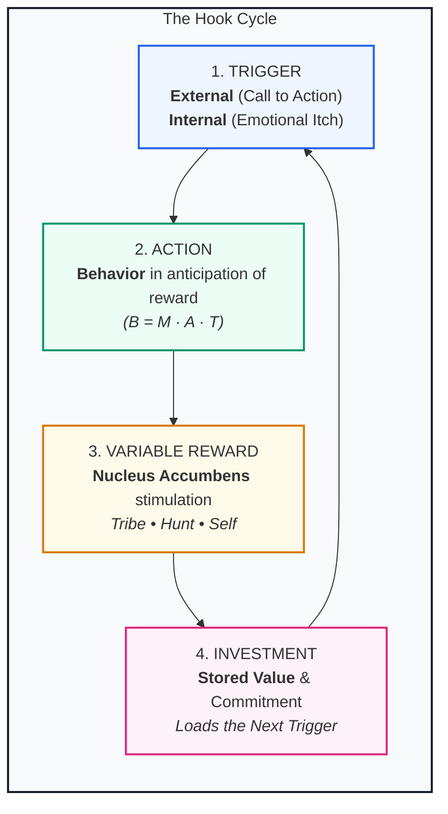
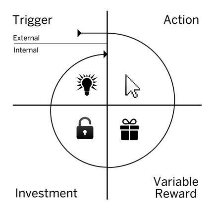

# Hooked: How to Build Habit-Forming Products
### *By Nir Eyal (with Ryan Hoover)*

> *"The products and services we use habit-formingly alter our everyday behaviors, just as their designers intended."*

---

## Executive Overview & Core Ideology

Why do some products capture widespread attention and become daily necessities while others flop? Why do 79% of smartphone owners check their devices within 15 minutes of waking up, and why do billions reflexively open Instagram, Twitter, YouTube, or Slack without any conscious decision to do so?

In ***Hooked: How to Build Habit-Forming Products***, behavioral engineer Nir Eyal reveals the hidden architecture behind the world’s most successful habit-forming technologies. Rather than relying on expensive, continuous advertising, market-leading companies design user experiences that anchor into **internal psychological triggers** (boredom, loneliness, insecurity, uncertainty, FOMO) and drive automatic, subconscious loops of engagement.

This repository contains an **end-to-end distillation and ideological analysis** of *Hooked*. It examines the neurological, behavioral, economic, and moral foundations of behavioral engineering, providing modern product builders, researchers, and system designers with a complete reference guide.

---

## The Hook Model: The 4-Step Behavioral Engine

At the core of the book is **The Hook Model**—an iterative four-phase cycle that, when navigated repeatedly, wires a product into a user's automatic neural routines (the basal ganglia) until the behavior becomes self-sustaining without external prompts.




*Figure 1: The Hook Model — Trigger, Action, Variable Reward, and Investment.*

---

## The Core Tenets of the *Hooked* Ideology

### 1. First-To-Mind Wins (The Mind Monopoly)
In the digital economy, cognitive economy rules. When a user experiences a problem or emotional discomfort, the product that surfaces first in their subconscious mind captures the market. Searching equals **Google**. Social boredom equals **Instagram** or **TikTok**. Professional networking equals **LinkedIn**. Habits create defensible **"Mind Monopolies"** that outlast feature competition.

### 2. From Vitamin to Painkiller
Investors often debate whether a startup is a "vitamin" (nice to have) or a "painkiller" (relieves acute discomfort). Habit-forming technologies pull off a unique psychological sleight of hand: **they begin as vitamins and evolve into painkillers**. A new product starts as a pleasant novelty, but as the Hook cycle repeats, the absence of the product creates a genuine psychological itch—a micro-pang of anxiety, boredom, or uncertainty—that only the product can alleviate.

### 3. Simplicity Trumps Motivation ($B = MAT$)
Drawing on Dr. B.J. Fogg’s Behavior Model, behavior is a function of Motivation, Ability, and a Trigger. While most companies waste millions attempting to artificially hype user motivation, elite product designers relentlessly eliminate cognitive, physical, temporal, and financial friction to elevate **Ability**. Make the intended action easier than thinking.

### 4. Dopamine Anticipation & Variable Reinforcement
Drawing on B.F. Skinner’s operant conditioning and Wolfram Schultz’s neurobiology of dopamine, the human brain’s pleasure center (nucleus accumbens) is activated not by the reward itself, but by the **unpredictable anticipation** of the reward. Introducing variability across **Social validation (Tribe)**, **Information/Resource acquisition (Hunt)**, and **Mastery/Competence (Self)** transforms routine actions into compelling compulsions.

### 5. Stored Value & The IKEA Effect
Unlike physical goods that depreciate with usage, habit-forming software **appreciates in value** the more users interact with it. By asking users for small investments of time, data, effort, social capital, or skill, users irrationally overvalue the service (the IKEA effect), raise their switching costs, and program future triggers that draw them back into the loop.

### 6. The Moral Imperative of Behavioral Design
Building habit-forming products is a form of behavioral engineering. Because designers can alter subconscious behavior at scale, ethical discernment is mandatory. Nir Eyal provides the **Manipulation Matrix** (Facilitator, Peddler, Entertainer, Dealer) to distinguish between products that genuinely enhance human flourishing versus predatory traps that induce destructive addiction.

---

## Repository Architecture & Reading Guide

This repository is structured into two core sections: **Ideological Frameworks** (the macro-theory, psychology, economics, and builder toolkits) and **End-to-End Chapter Analyses** (the chapter-by-chapter distillation of the source material).

```
.
├── README.md                                 # Master overview and ideology index
├── ideology/
│   ├── 01-the-hook-philosophy.md             # The Economics & Moats of Habit Formation
│   ├── 02-behavioral-psychology.md           # Cognitive Neuroscience, Heuristics & Biases
│   ├── 03-the-hook-mechanics.md              # Deep Dive into the 4 Phases
│   ├── 04-the-manipulation-matrix.md         # Ethics, Addiction vs. Habit & Responsibility
│   └── 05-the-builder-playbook.md            # Actionable Habit Testing & Diagnostic Playbook
├── chapters/
│   ├── 00-introduction.md                    # Habits as Neural Shortcuts & First-to-Mind
│   ├── 01-the-habit-zone.md                  # Ch 1: LTV, Pricing Power, 9x Rule & The Habit Zone
│   ├── 02-trigger.md                         # Ch 2: External vs. Internal Triggers & The 5 Whys
│   ├── 03-action.md                          # Ch 3: Fogg Model (B=MAT), Simplicity & Heuristics
│   ├── 04-variable-reward.md                 # Ch 4: Dopamine, Tribe/Hunt/Self & Autonomy
│   ├── 05-investment.md                      # Ch 5: IKEA Effect, 5 Types of Stored Value & Triggers
│   ├── 06-morality-of-manipulation.md        # Ch 6: The Manipulation Matrix & Responsible Design
│   ├── 07-case-study-the-bible-app.md        # Ch 7: Deep Case Study: YouVersion Bible App
│   └── 08-habit-testing-and-opportunities.md # Ch 8: Identify-Codify-Modify & Nascent Behaviors
└── assets/
    └── images/                               # Extracted figures and visual artifacts (00001 - 00042)
```

---

## Quick Navigation Index

| Section | Topic | Core Concept |
| :--- | :--- | :--- |
| [**Ideology 01**](ideology/01-the-hook-philosophy.md) | **The Hook Philosophy** | CLTV, Pricing Power, Virality, 9x Effect, Mind Monopoly |
| [**Ideology 02**](ideology/02-behavioral-psychology.md) | **Behavioral Psychology** | System 1 vs 2, $B=MAT$, Dopamine, Nucleus Accumbens, Heuristics |
| [**Ideology 03**](ideology/03-the-hook-mechanics.md) | **The 4 Hook Phases** | Triggers (Internal/External), Action, Variable Rewards, Stored Value |
| [**Ideology 04**](ideology/04-the-manipulation-matrix.md) | **Ethics & Manipulation** | The Manipulation Matrix: Facilitator vs Dealer, Habit vs Addiction |
| [**Ideology 05**](ideology/05-the-builder-playbook.md) | **The Builder's Playbook** | 5 Core Questions, Habit Testing (Identify/Codify/Modify) |
| [**Chapter 00**](chapters/00-introduction.md) | **Introduction** | Brain automaticity, basal ganglia, first-to-mind wins |
| [**Chapter 01**](chapters/01-the-habit-zone.md) | **The Habit Zone** | Frequency vs. Perceived Utility, Vitamins vs. Painkillers |
| [**Chapter 02**](chapters/02-trigger.md) | **Trigger** | Paid, Earned, Relationship, Owned & Internal emotional triggers |
| [**Chapter 03**](chapters/03-action.md) | **Action** | Fogg Behavior Model, 6 Simplicity Levers, Scarcity, Framing |
| [**Chapter 04**](chapters/04-variable-reward.md) | **Variable Reward** | Rewards of the Tribe, Hunt, Self; Finite vs. Infinite variability |
| [**Chapter 05**](chapters/05-investment.md) | **Investment** | IKEA effect, Stored Value (Content, Data, Followers, Rep, Skill) |
| [**Chapter 06**](chapters/06-morality-of-manipulation.md) | **The Morality of Manipulation** | Quadrant breakdown of creator intent and user impact |
| [**Chapter 07**](chapters/07-case-study-the-bible-app.md) | **Case Study: The Bible App** | How YouVersion hooked 100M+ users with spiritual routines |
| [**Chapter 08**](chapters/08-habit-testing-and-opportunities.md) | **Habit Testing & Opportunities** | Habit Path codification, nascent behaviors, interface shifts |

---

## Key Synthesis Table: The Four Phases at a Glance

| Phase | Primary Function | Psychological Driver | Product Implementation |
| :--- | :--- | :--- | :--- |
| **1. Trigger** | Tells the user to act; sparks the behavior | External: Cues in environment.<br/>Internal: Negative emotional state (itch). | Push notifications, app icons, emails transitioning into reflexive responses to boredom, FOMO, or doubt. |
| **2. Action** | The minimum physical/mental behavior done for reward | BJ Fogg Model: $B = MAT$. High motivation, high ability (near zero friction). | 1-click checkout, single-tap camera, infinite scroll, SSO (Log in with Google/Facebook). |
| **3. Variable Reward** | Satiates user's desire while leaving them wanting more | Dopamine surge in nucleus accumbens due to unpredictable outcomes. | **Tribe**: Likes, comments, social standing.<br/>**Hunt**: Feed updates, deals, news.<br/>**Self**: Clearing inbox, leveling up. |
| **4. Investment** | User puts work into the product to store future value | Escalation of commitment, IKEA effect, cognitive dissonance avoidance. | Building playlists, logging personal data, curating follower graphs, mastering workflows, loading next trigger. |
