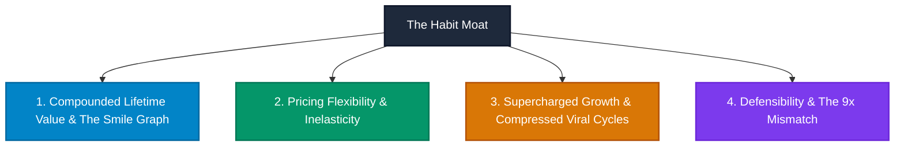

# Chapter 1: The Habit Zone

> *"Habits form when the brain takes a shortcut and stops actively deliberating over what to do next. The brain quickly learns to codify behaviors that provide a solution to whatever situation it encounters."* — Nir Eyal

---

## The Autopilot Mind: How Habits Direct Daily Life

Nir Eyal opens Chapter 1 with a personal anecdote illustrating the insidious power of behavioral routines. Accustomed to running in the morning, a sudden overseas business call forced him to shift his run to dusk. 

During the run, his mind drifted onto autopilot:
- Passing a neighbor taking out trash at twilight, he cheerfully saluted: *"Good morning!"* Minutes later, passing another runner, he reflexively repeated the mistake.
- Back home, while showering after his run, his brain executed its standard post-run script: he lathered up his face and started shaving at 9:00 PM, only stopping when he nicked his jaw.

Ingrained habits—behaviors executed with little or no mindful awareness—guide **nearly half of all daily human actions**. By storing automated behavioral scripts in the **basal ganglia**, the brain conserves conscious attention for novelty and survival threats.

---

## Why Habits Are Exceptional Business Drivers

Habits are not merely psychological curiosities; they are the ultimate engine of sustained enterprise profitability. Eyal identifies four structural business moats generated by habit formation:



### 1. Increasing Customer Lifetime Value (CLTV)
Customer Lifetime Value is the net financial return generated over the total lifespan of a user’s relationship with a service.
- In transactional software, retention curves decay continuously toward zero.
- In habit-forming products, retention curves exhibit what Evernote CEO Phil Libin called the **"Smile Graph"**: usage dips slightly in month one, stabilizes, and then **increases over time** as users store more notes and data. A user acquired three years ago is more engaged and valuable today than a newly acquired user.

### 2. Providing Pricing Flexibility
Warren Buffett famously observed:
> *"The single most important decision in evaluating a business is pricing power. If you’ve got the power to raise prices without losing business to a competitor, you’ve got a very good business."*

Because conscious comparison shopping requires effortful prefrontal cortex processing (System 2), habitual consumers stay loyal despite price hikes. When Evernote shifted features from its free tier to its paid tier, users paid because the friction of migrating their life’s archive to a competitor was unthinkable.

### 3. Supercharging Growth and Compressing Viral Cycle Time
Viral growth is determined by the **Viral Cycle Time**—the speed with which existing users expose new prospects to the product.
- If a user opens an app once every two weeks, their referral frequency is sluggish.
- If a user habitually checks an app 20 times a day (e.g., WhatsApp, Instagram), they create dozens of daily opportunities to share links, send invites, and expose their network to the product. Frequent usage physically compresses the viral cycle from weeks to minutes.

### 4. Sharpening the Competitive Edge: The 9x Effect & The QWERTY Moat
Why can’t superior new products easily unseat entrenched incumbents?

Harvard business professor John Gourville framed the **9x Effect**:
1. Consumers irrationally overvalue their existing products and habits by a factor of **3x** (due to loss aversion and behavioral familiarity).
2. Product creators irrationally overvalue the innovative features of their new technology by a factor of **3x**.
3. The resulting perceptual mismatch is **9x** ($3 \times 3$). A new product cannot merely be 20% better; it must be **nine times better** to compel users to incur the cognitive penalty of unlearning an old routine.

*The Classic Parable: The QWERTY Keyboard.*
Invented in 1873 by Christopher Latham Sholes to prevent metal mechanical typewriter arms from jamming, the QWERTY layout is notoriously sub-optimal. In 1932, August Dvorak engineered a layout that placed the most common letters on the home row, dramatically increasing typing speed and reducing finger strain. Yet, Dvorak failed completely. The ingrained muscle memory of billions of typists created an insurmountable habit moat that persists to this day.

---

## The Habit Zone

Not every product can or should form a habit. To determine viability, a behavior must be plotted on **The Habit Zone** grid:


*Figure 2: The Habit Zone — Plotting Frequency vs. Perceived Utility.*

```
Perceived Utility
      ^
 High |           [AMAZON]
      |      High Utility, Low/Moderate Frequency
      |             \
      |              *------------------------ (Habit Zone Threshold)
      |                                       \
  Low |                                        [GOOGLE / TWITTER]
      |                                        High Frequency, Low Utility
      +-------------------------------------------------------------------->
     Low                                                            High
                                  Frequency
```

### The Inviolable Law of Frequency
- **High Utility / Low Frequency**: Products like TurboTax, car dealerships, or mortgage brokers provide massive perceived utility, but occur once a year or once a decade. They can build successful businesses, but **they cannot build habits**. They must constantly re-acquire users through advertising and SEO.
- **Low Utility / High Frequency**: Products like Google Search, Twitter, or Instagram provide subtle, incremental utility per interaction, but occur dozens of times per day. They sit squarely in the **Habit Zone**.

> [!WARNING]
> **The Habit Threshold**: If a consumer technology product does not occur at least **once per week**, it will almost certainly fail to establish an unassisted habit loop. Human memory and cognitive friction reset after seven days of inactivity.

---

## Vitamins vs. Painkillers

The venture capital community frequently challenges founders: *"Is your startup a vitamin or a painkiller?"*

```
Painkillers  : Alleviate an obvious, quantifiable pain (Aspirin). Immediate purchase.
Vitamins     : Satisfy an emotional desire, nice-to-have, unquantifiable ROI.
```

Eyal exposes the fallacy of this dichotomy: **Habit-forming products start as vitamins and transform into painkillers.**

When Facebook or Instagram launched, nobody was suffering from a clinical shortage of social media feeds. They were vitamins—fun, playful novelties. But once the Hook cycle repeated over days and weeks, **the product synthesized a new psychological itch**:
- An unoccupied elevator ride now feels uncomfortably boring.
- Eating lunch alone suddenly produces social insecurity.
- The silence in a room triggers FOMO (Fear Of Missing Out).

The product creates the mental itch and immediately presents itself as the only painkiller that can soothe it.

---

## Remember and Share

- **Habits are basal ganglia routines** that conserve mental bandwidth by executing behaviors without conscious deliberation.
- **Habits provide four massive business superpowers**: higher Customer Lifetime Value (CLTV), pricing flexibility, hypercharged viral cycle compression, and unassailable 9x defensibility.
- **The Habit Zone** requires a balance between frequency and perceived utility; behaviors occurring less than once a week rarely form habits.
- **Habit-forming technologies begin as vitamins** (nice-to-have novelties) and **mature into painkillers** (alleviating the emotional itch they created).

---

## Do This Now (Action Exercises)

1. **Map Your Frequency**: Does your product’s core behavior naturally occur multiple times per day, daily, or at least once per week? If not, what auxiliary features can you introduce to increase touchpoint frequency?
2. **Identify the Painkiller Transformation**: What was the initial "vitamin" appeal of your product, and what specific psychological itch does it relieve once a user becomes accustomed to it?
3. **Audit Your 9x Barrier**: What existing habits or cognitive switching costs must a new user unlearn to adopt your solution? Are you delivering a 9x improvement to overcome this friction?
