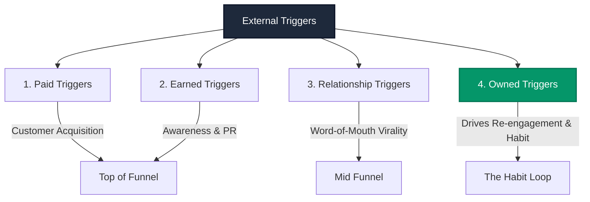
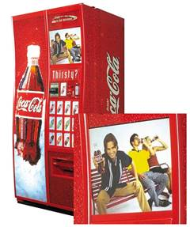

# Chapter 2: Trigger

> *"Triggers provide the basis for sustained behavior change. A trigger is the actuator of behavior—the grit in the oyster that precipitates the pearl."* — Nir Eyal

---

## Habits Are Built Like Pearls

How does an oyster create a natural pearl? It does not begin out of thin air; it starts with a **tiny irritant**—a foreign piece of sand, grit, or a parasite that enters the shell. To protect itself, the oyster blankets the irritant with layer upon layer of iridescent nacre (mother-of-pearl) over years.

Similarly, new human habits do not materialize spontaneously. They require an underlying foundation—a spark plug to initiate the behavioral sequence. **Triggers are the actuators of behavior.**

The chapter begins with the case of **Yin**, a Stanford University student who uses Instagram compulsively dozens of times a day. Yin doesn't consider herself "addicted," yet she admits: *"Whenever I see something cool, I feel I need to grab it before it's gone."* How did this simple photo app entrench itself so deeply into her daily routines? Through the relentless orchestration of **External and Internal Triggers**.

---

## External Triggers: The Environmental Information

External triggers embed actionable information within a user's sensory environment, explicitly communicating what action to take next. Eyal delineates four distinct classes:



### 1. Paid Triggers (Advertising & Acquisition)
- **Mechanism**: Google AdWords, Meta sponsored feeds, television commercials, display ads.
- **Role**: Highly effective for kickstarting customer acquisition.
- **The Catch**: Paying for every interaction is economically unsustainable over the long term. Companies that rely permanently on paid triggers go bankrupt when Customer Acquisition Costs (CAC) exceed Customer Lifetime Value (CLTV).

### 2. Earned Triggers (PR & Media Spikes)
- **Mechanism**: Press features in the *New York Times*, viral YouTube videos, App Store "App of the Day" placements.
- **Role**: Delivers rapid, temporary bursts of traffic and brand legitimacy.
- **The Catch**: Completely unpredictable, non-repeatable, and impossible to schedule reliably.

### 3. Relationship Triggers (Viral Peer Influence)
- **Mechanism**: Word-of-mouth recommendations, PayPal's \$10 referral bonus, Dropbox's extra storage incentives, or WhatsApp address book invites.
- **Role**: Drives hypergrowth by weaponizing the user's existing social graph.
- **The Catch**: High vulnerability to viral fatigue. If an app coerces users into spamming their friends (like early Facebook games), users feel exploited and delete the app.

### 4. Owned Triggers (The Foundation of Habit Formation)
- **Mechanism**: An app icon permanently sitting on the phone home screen, opt-in push notifications, opt-in SMS alerts, or a curated email newsletter.
- **The Strategic Imperative**: The user has **explicitly granted permission** for the company to enter their personal cognitive space. Owned triggers cost near-zero marginal dollars to send and serve as the repeated external catalyst that eventually trains internal automaticity.

---

## Internal Triggers: The Emotional Itch

While external triggers get users into the door, **a habit is only formed when an internal trigger takes over**.

Internal triggers do not rely on environmental cues. They manifest automatically inside the human mind, inextricably wired to **negative emotions and micro-pangs of psychological discomfort**:

```
                       THE INTERNAL EMOTIONAL ITCH
========================================================================
Emotional Trigger (The Discomfort)   --> Reflexive Solution (The Balve)
----------------------------------       ------------------------------
Boredom                              --> YouTube, Reddit, TikTok
Loneliness & Alienation              --> Instagram, Facebook
Uncertainty / Ignorance              --> Google
Professional Anxiety / FOMO          --> LinkedIn, Slack, Email
Fatigue / Disconnection             --> Twitter, Casual Games
========================================================================
```

> [!IMPORTANT]
> **The Secret of Internal Triggers**: Habitual tech usage is an act of **emotional self-medication**. We do not pick up our smartphones because an alarm rang; we pick them up because we felt a fleeting sensation of restlessness, anxiety, loneliness, or boredom. The product provides instantaneous emotional relief.

Once an emotional state is paired with a product enough times, the association is burned into the basal ganglia. The user reaches for the app without a single external prompt.

---

## Uncovering the Root Trigger: The "5 Whys" Method

Product teams often fail because they design for superficial, technical problems rather than deep emotional itches. To uncover the true internal trigger, Nir Eyal prescribes the **5 Whys** method, pioneered by Sakichi Toyoda for the Toyota Production System:

```
[Observation]: Julie, a business traveler, checks her mobile email compulsively.
├── WHY 1? Why does she check email on her phone?
│   └── "To see incoming messages while on the road."
├── WHY 2? Why does she need to see them immediately?
│   └── "To respond to clients and colleagues in real time."
├── WHY 3? Why does she need to respond in real time?
│   └── "Because delays might hold up deals or project deadlines."
├── WHY 4? Why does she fear holding up deals?
│   └── "Because it would make her look disorganized and uncommitted."
└── WHY 5 (THE ROOT INTERNAL TRIGGER)?
    └── "She has a deep-seated fear of losing professional status and being replaced."
```

*Architectural Takeaway*: Julie’s product need is not "faster email synchronization"; it is **soothing acute professional vulnerability and status anxiety**.

---

## Unpacking Instagram’s Triggers

Instagram is a masterclass in trigger architecture:


*Figure 3: Unpacking External and Internal Triggers.*

1. **Initial External Phase**:
   - Relationship Triggers: Cross-posting stylish, filtered photos to Facebook and Twitter exposed non-users to Instagram.
   - Owned Triggers: Push notifications alerted users whenever friends joined or liked photos.
2. **Internal Phase Transition**:
   - The primary internal trigger: **The Fear of Losing a Fleeting Moment** (Nostalgia and mortality). Taking a photo captures an ephemeral sunset, meal, or smile before it vanishes.
   - Secondary internal triggers: **Boredom** (browsing the feed for visual novelty) and **Social Insecurity** (seeking peer approval via heart likes).

---

## Remember and Share

- **Triggers cue the user to take action**: They are the first step in the Hook Model.
- **External triggers** embed instructions in the user's environment: Paid, Earned, Relationship, and Owned.
- **Owned triggers are the key to habit formation**: They keep the user returning until internal triggers take root.
- **Internal triggers manifest as negative emotional states**: Boredom, loneliness, fear, and insecurity drive automatic digital responses.
- **Use the 5 Whys framework** to drill past superficial features and isolate the emotional discomfort your product soothes.

---

## Do This Now (Action Exercises)

1. **Identify Your User's Core Internal Trigger**: Write down the primary negative emotion that drives your user to seek a solution. Is it boredom, anxiety, loneliness, uncertainty, or fatigue?
2. **Execute a "5 Whys" Drill**: Interview three users. Start with why they use your tool, and ask "Why?" five consecutive times until you reach an emotional state.
3. **Map Your External-to-Internal Bridge**: What owned external triggers (push, email, notifications) are you using today, and how do they prime the user to eventually return unprompted?
