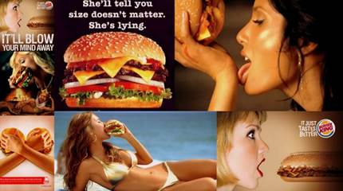

# Chapter 3: Action

> *"To initiate action, doing must be easier than thinking. Remember, a habit is a behavior done with little or no conscious thought. The more effort—either physical or mental—required to perform the desired action, the less likely it is to occur."* — Nir Eyal

---

## Action vs. Inaction: The Behavioral Threshold

A trigger informs the user of what to do next. But if the user does not take action, the trigger is dead weight.

To unpack what compels a human being to act, Nir Eyal introduces the **Fogg Behavior Model (FBM)**, developed by Dr. B.J. Fogg at Stanford University:

$$\mathbf{B = M \cdot A \cdot T}$$

> **A behavior ($B$) will occur only when Motivation ($M$), Ability ($A$), and a Trigger ($T$) converge at the same instant in sufficient degrees.**


*Figure 4: The Fogg Behavior Model — Motivation vs. Ability.*

### The Ringing Phone Thought Experiment
Fogg illustrates the model with a ubiquitous everyday scenario: your mobile phone rings, but you do not answer it. Why?
1. **Ability was missing**: The phone was buried deep inside a backpack in another room.
2. **Motivation was missing**: You saw caller ID and realized it was an annoying telemarketer or an ex-partner.
3. **Trigger was missing**: The caller was your dream employer and the phone was in your hand, but you had turned the ringer on silent.

If any one component fails, the user falls below the **Action Line**, and action does not occur.

---

## The First Ingredient: Motivation

Motivation defines the level of energy and desire to perform a behavior. Dr. Fogg identifies **Three Core Motivational Pairs**:

```
                       THE THREE CORE MOTIVATORS
========================================================================
1. SENSATION     --> Seeking PLEASURE  vs.  Avoiding PAIN
2. ANTICIPATION  --> Seeking HOPE      vs.  Avoiding FEAR
3. SOCIAL BELONGING --> Seeking ACCEPTANCE vs. Avoiding REJECTION
========================================================================
```

- **Pleasure vs. Pain**: Fast food brands (Carl’s Jr., Burger King) utilize hyper-sexualized, visceral food imagery to trigger immediate sensory pleasure.
- **Hope vs. Fear**: Public health campaigns utilize fear to break lethargy. The iconic brain injury PSA shows a patient with a traumatic injury above the words: *"I won’t wear a helmet, it makes me look stupid."*
- **Social Acceptance vs. Rejection**: Beer commercials never describe the chemical composition of malt and hops; they showcase groups of attractive, bonded friends celebrating a soccer victory together, triggering our deep evolutionary craving for tribal inclusion.

---

## The Second Ingredient: Ability (The Six Elements of Simplicity)

While motivation provides the fuel, **Ability dictates execution**. Ability is the capacity to complete an action. Nir Eyal emphasizes that **Simplicity is a function of the user's scarcest resource at that given second**.

Fogg articulates the **Six Elements of Simplicity**:

```
[1. TIME]            --> How long does it take?
[2. MONEY]           --> How much financial capital is required?
[3. PHYSICAL EFFORT] --> How much physical exertion is demanded?
[4. BRAIN CYCLES]    --> How much mental concentration is required?
[5. SOCIAL DEVIANCE] --> How far does this break social norms?
[6. NON-ROUTINE]     --> How much does this disrupt established habits?
```

### Which Should You Increase First: Motivation or Ability?

> [!IMPORTANT]
> **The Builder's Axiom: Always Increase Ability First.**
> Product teams routinely waste hundreds of thousands of dollars attempting to hype user motivation through marketing copy, videos, and discounts. But motivation is difficult, expensive, and mercurial. **Removing friction (elevating Ability) is vastly more predictable and yields exponential conversion gains.**

### Case Studies in Radical Ability Optimization

1. **Logging In with Facebook**:
   Traditional web registration required entering an email, creating a password, re-entering the password, solving a CAPTCHA, and verifying an activation link. Facebook Single Sign-On collapsed six cognitive hurdles into a single click.

2. **The Twitter Button**:
   Instead of asking a reader to open a new tab, navigate to Twitter, copy an article URL, write a summary, and post, the embedded "Tweet" button pre-populates the headline, tags, and a shortened URL in a ready-to-fire modal.

3. **Searching with Google**:
   In 1998, the Yahoo homepage was an overwhelming wall of categories, links, and banners. Google stripped everything away except a clean logo, a single search box, and two buttons. Simplicity crushed the incumbent.

4. **The Apple iPhone Lock-Screen Camera Gesture**:
   Apple recognized that the friction of unlocking a phone to capture a fleeting photograph caused millions of missed memories. By adding a physical camera swipe directly on the lock screen, Apple eliminated time, cognitive load, and physical effort.

5. **Infinite Scroll on Pinterest**:
   By replacing pagination numbers ("Page 1, 2, 3...") with an automated continuous scroll, Pinterest eliminated the cognitive micro-pause where users stop to consider leaving.

---

## Cognitive Heuristics: Psychological Shortcuts That Supercharge Action

Human decision-makers do not evaluate choices with purely rational logic. They rely on **heuristics**—mental rules of thumb that bias action:

### 1. The Scarcity Effect
Items perceived as scarce are valued significantly higher than abundant items.
- *The Proof*: Worchel, Lee, and Adewole (1975) gave subjects cookies from two identical jars: one with 10 cookies, one with 2 cookies. Subjects judged the cookies from the scarce jar to be significantly more delicious, desirable, and expensive.
- *Digital Application*: Amazon indicating *"Only 2 left in stock—order soon."*

### 2. The Framing Effect
The contextual environment radically alters subjective perception.
- *The Proof*: World-famous violinist Joshua Bell played a \$3.5 million Stradivarius in a Washington D.C. subway station. Over 1,000 people walked past without noticing, earning him \$32. Days earlier, patrons paid \$100+ per seat in concert halls.
- *Digital Application*: Elegant typography, high-contrast layouts, and sleek branding transform commodity software into premium experiences.

### 3. The Anchoring Effect
The human mind fixates disproportionately on the first piece of numeric information presented.
- *The Proof*: Steve Jobs introduced the iPad by displaying a giant "\$999" price tag on stage, declaring that pundits expected that price. He then smashed the anchor down to \$499, making the device feel like an irresistible bargain.

### 4. The Endowed Progress Effect
People accelerate their efforts as they perceive themselves nearing a goal.
- *The Proof*: Nunes and Drèze (2006) tested car wash loyalty punch cards:
  - Card A: 8 blank stamps required for a free wash.
  - Card B: 10 stamps required, but 2 stamps were already punched as a "free bonus."
  - Result: Although both cards required 8 actual purchases, **Card B had an 89% higher completion rate**.
- *Digital Application*: LinkedIn’s profile strength meter never starts at 0%; it gives the user 20% credit merely for signing up, nudging them to finish the rest.

---

## Remember and Share

- **Action is the second step in the Hook Model**: Without action, the trigger is useless.
- **The Fogg Behavior Model ($B = MAT$)** dictates that behavior occurs when Motivation, Ability, and Trigger align.
- **Simplicity is the easiest lever to pull**: Always focus on increasing Ability (cutting friction) before trying to artificially inflate Motivation.
- **Leverage the 6 Elements of Simplicity**: Time, Money, Physical Effort, Brain Cycles, Social Deviance, and Non-Routine.
- **Apply cognitive heuristics ethically**: Scarcity, Framing, Anchoring, and Endowed Progress can dramatically reduce the barrier to action.

---

## Do This Now (Action Exercises)

1. **Conduct an Action Friction Audit**: Walk through your product’s primary desired action. Count how many seconds, clicks, form fields, and cognitive decisions it demands. Where can you cut 50% of the steps?
2. **Identify Your Scarcest Resource**: Which of Fogg's 6 Elements of Simplicity is the biggest bottleneck for your target user right now?
3. **Incorporate Endowed Progress**: Does your onboarding flow start from scratch, or does it credit the user with immediate progress toward completion?
