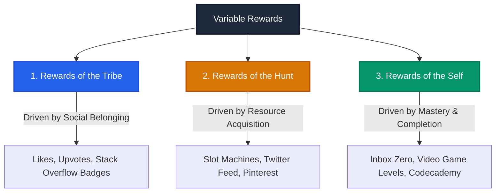

# Chapter 4: Variable Reward

> *"What draws us to act is not the sensation we receive from the reward itself, but the need to alleviate the craving for that reward. The nucleus accumbens is activated not when we receive a reward, but in anticipation of it."* — Nir Eyal

---

## The Neurochemistry of Craving

In the 1940s and 1950s, researchers **James Olds and Peter Milner** accidentally discovered a neural structure in lab rats that drove insatiable compulsions. When electrodes were implanted in the **nucleus accumbens**, rats would press a stimulation lever thousands of times an hour—forgoing food, water, and sleep, even running across painful electrified floor grids to keep pressing the lever.

Subsequent human trials produced identical results: subjects refused to relinquish the stimulation buttons, continuing to press them long after the current was deactivated. Olds and Milner concluded they had found the brain’s "pleasure center."

Decades later, Stanford neuroscientist **Brian Knutson** placed subjects in fMRI scanners while they played gambling games. The brain scans revealed a startling truth:
- The nucleus accumbens **did not light up when money was won**.
- It surged with intense neurological activity **in the anticipation of winning**.

Dopamine is not the chemical of pleasure; it is the chemical of **desire, seeking, and the urgent need to resolve uncertainty**.

---

## Skinner’s Pigeons and the Variable Schedule

B.F. Skinner demonstrated this neurochemical phenomenon through operant conditioning:
- **Fixed Schedule**: When pigeons received a food pellet every single time they pecked a disk, they ate when hungry and stopped immediately.
- **Variable Schedule**: When Skinner introduced intermittency—dispensing food pellets on an unpredictable, randomized ratio—the pigeons pecked compulsively and continuously.

Variability amplifies focus, suppresses conscious reasoning, and drives persistent behavioral loops.

---

## The Three Types of Variable Rewards

Nir Eyal categorizes all variable rewards in habit-forming technologies into three fundamental human desires:



### 1. Rewards of the Tribe (Social Validation)
Humans are an obligate social species. Our evolutionary survival depended on group cohesion, mutual protection, and peer esteem. Rewards of the tribe are fueled by the search for social acceptance, status, and validation:
- **Facebook / Instagram**: Checking notifications to discover how many friends "liked" a shared photo or commented on a life update.
- **Stack Overflow**: Professional software developers spend millions of uncompensated hours answering difficult technical queries. Why? For upvotes, reputation scores, and peer badges that signal technical supremacy within their tribe.
- **League of Legends**: Riot Games instituted an "Honor" scoring system where players award peers for honorable gameplay. This peer-conferred status reinforced prosocial norms while suppressing toxic behavior.

### 2. Rewards of the Hunt (Resource & Information Capture)
Early humans spent millennia hunting game and gathering sustenance under conditions of high unpredictability. Today, that evolutionary tracking instinct is channeled through digital interfaces:
- **The Modern Slot Machine / Pull-to-Refresh**: Swiping down on a Twitter, Instagram, or LinkedIn feed mimics the pull of a slot machine reel. Will the next item be a mundane corporate ad, an incendiary political take, or a career-altering message? The brain cannot rest until it checks.
- **Pinterest**: Users scroll an endless stream of visual "pins," hunting for aesthetic inspiration, home decor ideas, or culinary recipes.

### 3. Rewards of the Self (Competence, Mastery, and Completion)
Rooted in self-determination theory, humans possess an intrinsic desire to achieve competence, overcome challenges, and restore cognitive order:
- **Inbox Zero**: The email app Mailbox popularized the gesture-driven swipe to archive, turning the chore of processing correspondence into a game of clearing clutter to reveal a clean background image.
- **Video Games**: Advancing through levels, defeating bosses, unlocking rare armor, and conquering quests (*Angry Birds*, *World of Warcraft*).
- **Codecademy**: Breaking programming down into bite-sized syntax puzzles where typing the correct command produces an immediate green checkmark and audible chime.

---

## Finite vs. Infinite Variability

Why did Zynga's *Farmville* boom and then collapse into irrelevance, while *World of Warcraft*, YouTube, and Twitter endure for decades?

```
FINITE VARIABILITY                         INFINITE VARIABILITY
---------------------------------------    ---------------------------------------
• Predictable narrative arcs               • User-Generated Content (UGC)
• Fixed challenge ceilings                 • Dynamic social interaction
• Mechanical, repetitive loops             • Continuous real-world news flow
---------------------------------------    ---------------------------------------
Outcome: Dopamine ceases once the           Outcome: Novelty is never fully exhausted;
pattern is mastered. Churn follows.        habitual engagement lasts indefinitely.
```

Products built strictly around **finite variability** face an expiration date. Once the user figures out the rules and knows what to expect, the nucleus accumbens stops firing dopamine, boredom sets in, and the user departs. 

Sustainable habit-forming systems build engines of **infinite variability**—leveraging algorithmic feeds, multiplayer competition, and user-generated content that continuously output fresh unpredictability.

---

## Autonomy and Psychological Reactance: The Freedom Guardrail

Variable rewards must never feel coercive. When users sense that their free will is being manipulated, they experience **psychological reactance**—a visceral rebellion against the product:

> *"To maintain user trust, variable rewards must align with the user's intrinsic goals. If a product feels manipulative or predatory, users will delete it to assert their personal autonomy."*

Nir Eyal cites the famous compliance study testing the **"But You Are Free" (BYAF)** technique: researchers asking strangers for bus fare doubled their success rate (from 10% to 47%) simply by concluding with the words: *"But you are free to accept or refuse."* Preserving user agency is essential for sustainable retention.

---

## Remember and Share

- **The Nucleus Accumbens** is activated by the *anticipation* of reward, not the reward itself.
- **Variable schedules of reinforcement** drive dopamine surges and compulsive seeking behavior.
- **Three types of variable rewards**: Tribe (social validation), Hunt (information/material capture), and Self (mastery/completion).
- **Infinite variability is essential for longevity**: Finite variability leads to satiation and churn.
- **Preserve user autonomy**: Avoid manipulative gamification that triggers psychological reactance.

---

## Do This Now (Action Exercises)

1. **Classify Your Rewards**: Which of the three variable rewards (Tribe, Hunt, Self) does your product currently deliver? Can you introduce a missing dimension?
2. **Audit for Finite vs. Infinite Variability**: Does your product’s reward loop have an obvious ceiling where users run out of surprises? How can user-generated content or community interaction inject infinite variability?
3. **Check for Autonomy**: Do your notifications and rewards feel like helpful nudges or invasive, patronizing traps? How can you reinforce user agency?
