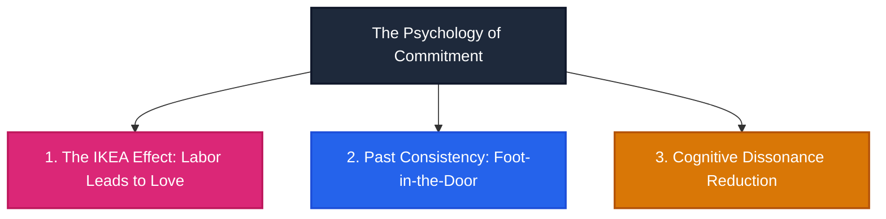
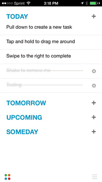
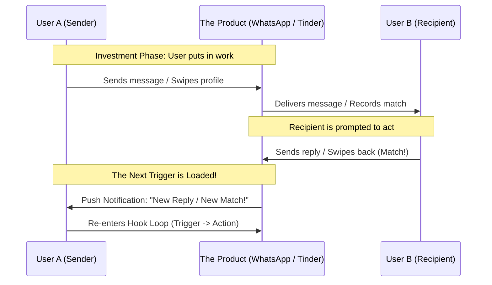

# Chapter 5: Investment

> *"The more users invest time and effort into a product or service, the more they value it. In fact, there is ample evidence to suggest that our labor leads to love."* — Nir Eyal

---

## Action vs. Investment: The Crucial Distinction

In the previous chapters, we learned that the **Action** phase must be as frictionless and instantaneous as possible ($B = MAT$).

The **Investment** phase operates under entirely different psychological rules:

```
                  ACTION PHASE vs. INVESTMENT PHASE
========================================================================
Dimension            Action Phase                 Investment Phase
------------------   --------------------------   ----------------------
Temporal Focus       Immediate gratification      Anticipation of future rewards
Effort Required      Minimal (near zero friction) Measurable work / effort
Primary Objective    Resolve current craving      Store value & load next trigger
Timing               Occurs before the reward     Occurs AFTER the reward
========================================================================
```

Why does investment occur *after* the variable reward? Because the user’s brain has just experienced a dopamine release and feels positive sentiment toward the product. This brief neurochemical window is the ideal moment to ask the user to put a "bit of work" into the system.

---

## The Behavioral Economics of Commitment

Nir Eyal unpacks three psychological principles that govern how human investment transforms into irrational loyalty:



### 1. The IKEA Effect: We Irrationally Value Our Own Labor
In 2011, researchers **Michael Norton, Daniel Mochon, and Dan Ariely** conducted a landmark experiment:
- Subjects folded simple origami cranes and frogs, while origami masters folded pristine, professional figures.
- When asked to bid on the origami creations, the builders valued their own crude, amateurish paper animals **five times higher** than outside observers did, placing their bids nearly equal to the creations of the masters.
- *Insight*: When we invest our personal labor into assembling a piece of IKEA furniture, a Spotify playlist, or a personal profile, our brains irrationally inflate its objective worth.

### 2. We Seek Consistency with Past Behaviors
Psychologists **Jonathan Freedman and Scott Fraser** tested the **Foot-in-the-Door technique**:
- Researchers asked suburban homeowners to display a massive, poorly lettered billboard reading *"DRIVE CAREFULLY"* on their front lawns. Only 17% agreed.
- In another neighborhood, researchers first asked homeowners to display a tiny, unobtrusive 3-inch sign reading *"Be a safe driver."* Two weeks later, they returned and asked to install the massive, ugly lawn billboard.
- **76% of the homeowners agreed** to have their front yards defaced. Why? Because refusing would violate their self-image of being a "safe driving advocate." Small, progressive investments bind our future actions to our past commitments.

### 3. We Avoid Cognitive Dissonance
Pioneered by **Leon Festinger**, cognitive dissonance describes the mental agony of holding conflicting beliefs and actions. Recall Aesop's fable of the Fox and the Grapes: unable to reach the fruit, the fox resolves his frustration by declaring, *"The grapes were sour anyway."*
In software, the reverse occurs: *"I have spent dozens of hours categorizing my notes and customizing this workspace; therefore, this product must be extraordinary."*

---

## Storing Value: Why Software Appreciates Over Time

Physical items—cars, furniture, clothing—depreciate the moment they leave the showroom. **Habit-forming software appreciates in value the more it is used.**

By investing work into the platform, users generate **Stored Value** across five distinct categories:

```
                       THE 5 TYPES OF STORED VALUE
========================================================================
1. CONTENT    --> Songs saved, playlists built, photos uploaded, notes written.
                  (e.g., Spotify, Apple Music, Google Photos, Evernote)

2. DATA       --> Financial history, running routes, medical tracking logs.
                  (e.g., Mint, Strava, Apple Health)

3. FOLLOWERS  --> Curated social graphs and personal distribution channels.
                  (e.g., Twitter/X, Substack, YouTube, LinkedIn)

4. REPUTATION --> Review ratings, seller scores, karma, and trust badges.
                  (e.g., Airbnb, eBay, Stack Overflow, Reddit)

5. SKILL      --> Muscle memory, keyboard shortcuts, specialized workflows.
                  (e.g., Photoshop, Vim, Figma, Salesforce)
========================================================================
```

Each unit of stored value raises the user’s **switching cost**. Migrating from Spotify to Apple Music isn't merely about paying \$10 a month; it means losing a decade of curated playlists and algorithmic music discovery trained on personal listening history.

---

## Loading the Next Trigger: Closing the Loop

The highest strategic purpose of the Investment phase is to **pre-program the next external trigger**, setting the trap for the next cycle:


*Figure 5: Any.do loads the next trigger by prompting for task reminders.*



- **Messaging (WhatsApp / iMessage)**: Sending a text (investment) costs effort, but it creates a social obligation for the recipient to reply, which arrives as a push notification (the next external trigger).
- **Tinder**: Swiping right on a card requires micro-effort. When the other user swipes right, Tinder fires an immediate push alert: *"You have a new match!"*
- **Any.do**: Entering a task schedules an automated alert at the exact moment a calendar event ends, re-engaging the user when anxiety is high.

---

## Remember and Share

- **Investment occurs after the variable reward phase**, when user goodwill and dopamine levels are highest.
- **Investments are not about immediate gratification**; they demand work to improve future product experiences.
- **The IKEA Effect and cognitive dissonance** cause users to irrationally overvalue products they have contributed to.
- **Stored value compounds over time**: Content, Data, Followers, Reputation, and Skill construct an unassailable switching barrier.
- **The ultimate goal of investment is to load the next trigger**, cycling the user back into the Hook loop automatically.

---

## Do This Now (Action Exercises)

1. **Audit Your Product’s Investment Ask**: What specific "bit of work" are you asking users to invest immediately after receiving a reward? Is it small enough to prevent abandonment?
2. **Catalog Your Stored Value**: Which of the five types of stored value (Content, Data, Followers, Reputation, Skill) does your product build? How can you make that stored value more visible to the user?
3. **Map the Next Trigger**: Does the user's investment explicitly load a future external trigger (a friend’s reply, a scheduled reminder, an algorithmic update), or does the loop hit a dead end?
