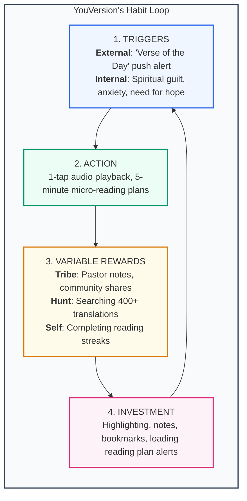

# Chapter 7: Case Study: The Bible App (YouVersion)

> *"How did YouVersion come to dominate the digital 'word of God'? It turns out there is much more behind the app’s success than missionary zeal. It’s a masterclass in how technology can change behavior by marrying consumer psychology with big data analytics."* — Nir Eyal

---

## From Ancient Scripture to Viral App

In July 2013, a free mobile app called simply **"Bible"** crossed **100 million downloads**, placing it in the rarefied technological stratosphere of Facebook, Instagram, and Twitter. Developed by **Bobby Gruenewald** and a small team at Life.Church in Edmond, Oklahoma, the YouVersion Bible app was recording a new installation every 1.3 seconds and 66,000 user sessions every second.

Searching the Apple App Store for "Bible" returned over 5,185 competing applications. Yet YouVersion achieved near-total market dominance. 

How did a tech team transform an ancient, intimidating, 1,200-page religious text into one of the most compulsively habit-forming mobile experiences in history? By rigorously operationalizing **The Hook Model**.

---

## The Failed Beginning: Web vs. Mobile

In 2007, Gruenewald initially launched YouVersion as a traditional desktop website. It was an abysmal failure. Users did not sit at desktop computers to read the Bible. 

When Apple announced the launch of the App Store in 2008, Gruenewald realized that **context dictates behavior**:
- The mobile phone is a personal talisman carried into bedrooms, subways, and dinner tables.
- A mobile app could deliver micro-engagements throughout the day, fitting into moments where reading a physical book was impossible.

---

## YouVersion Deconstructed Through the Hook Model

### 1. Phase 1: Trigger
- **External Triggers**:
  - **Owned Triggers**: Daily push notifications delivering the "Verse of the Day" directly to the lock screen.
  - **Relationship Triggers**: Every Sunday morning, pastors across tens of thousands of churches instruct congregations: *"Take out your Bibles or open your YouVersion app."*
- **Internal Triggers**:
  - Spiritual guilt (feeling like a "bad Christian" for not reading scripture).
  - Anxiety, fear, loneliness, or emotional turmoil.
  - The routine transition of waking up or falling asleep.

### 2. Phase 2: Action (Radical Simplification)
Reading the physical Bible is daunting. It contains hundreds of archaic genealogies and dense theological prose. YouVersion eliminated every friction point:
- **Audio Mode**: For commuters or busy parents, a single tap plays professional dramatized audio.
- **Bite-Sized Reading Plans**: Instead of reading Genesis to Revelation, users choose targeted plans (e.g., *"Dealing with Stress in 5 Days"*, *"Overcoming Grief"*). Reading requires just 3 to 5 minutes per day.
- **Fogg's Ability Formula**: Time is cut to minutes, cognitive effort is cut by curated selections, and physical effort is cut to a single tap.

### 3. Phase 3: Variable Reward
- **Rewards of the Tribe (Social)**:
  - Users see which verses their friends and pastors have highlighted.
  - Verses can be converted into beautifully styled image graphics with one tap and shared to Instagram and Twitter for social validation.
- **Rewards of the Hunt (Information Discovery)**:
  - With over 400 translations in dozens of languages, users can "hunt" for the exact translation (King James, NIV, The Message) that unlocks emotional resonance for their situation.
- **Rewards of the Self (Mastery & Streaks)**:
  - Checking off a daily reading plan displays a vibrant completion screen and increments the user's consecutive day streak counter.

### 4. Phase 4: Investment & Loading the Next Trigger
- **Stored Value**:
  - **Content**: Verses highlighted in neon colors, bookmarks, and private journals.
  - **Data**: Complete history of completed reading plans and personal growth reflections.
  - **Followers**: Connecting with congregation members and friends.
- **Loading the Next Trigger**:
  - Subscribing to a 14-day reading plan explicitly licenses YouVersion to schedule 14 consecutive morning push notifications. The investment automatically programs future triggers.

---

## Why YouVersion Sits in the Facilitator Quadrant

Bobby Gruenewald did not build YouVersion as an extractive monetization scheme. Life.Church operates as an evangelical non-profit; the app contains no advertisements, charges no subscription fees, and sells no user data.

Gruenewald built an experience that he and his team personally use every single day to deepen their faith, and they genuinely believe it materially improves the spiritual lives of millions. By operating as a **Facilitator**, YouVersion applied the Hook Model with profound empathy and integrity.

---

## Remember and Share

- **YouVersion conquered a crowded market** of 5,000+ competitors by mastering mobile behavioral design.
- **Desktop reading failed**; mobile enabled high-frequency micro-engagements.
- **Radical simplification** (audio streaming and 5-minute curated plans) lowered the action threshold above the Fogg Action Line.
- **Investments in reading plans** pre-program automated external push notifications for subsequent days.
- **Operating as a Facilitator** unlocks the highest levels of design intuition, moral clarity, and user trust.
