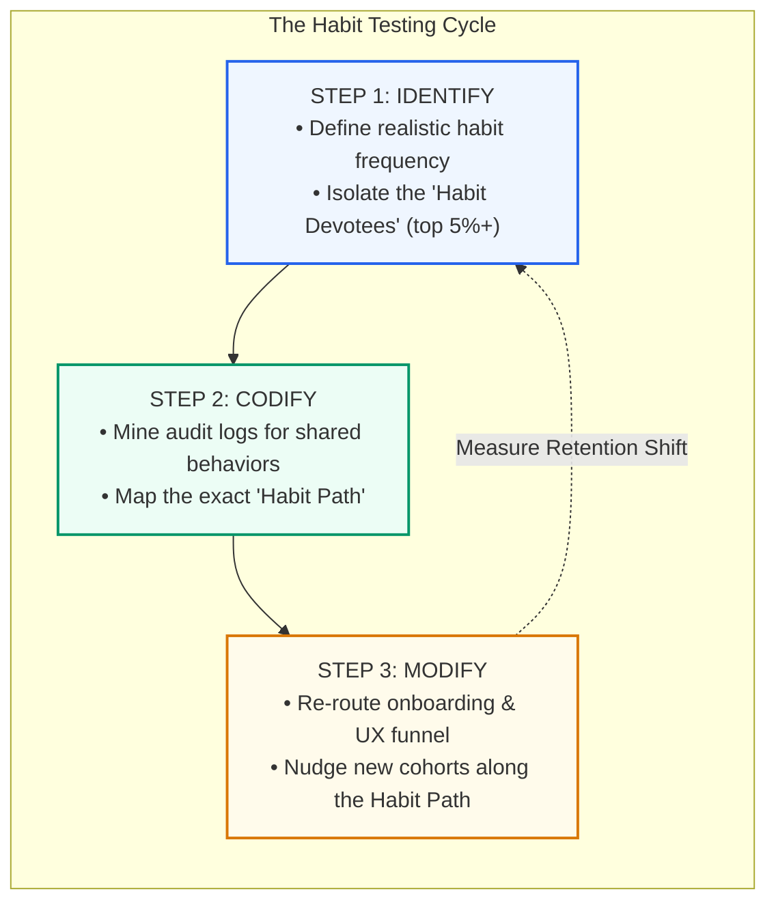

# Chapter 8: Habit Testing & Where to Look for Habit-Forming Opportunities

> *"Building a habit-forming product is an iterative process requiring user behavior analysis and continuous experimentation. Habit Testing clarifies who your devotees are, what parts of your product are habit-forming, and why those aspects are changing user behavior."* — Nir Eyal

---

## Moving from Theory to Execution

Understanding the psychology of the Hook Model is essential, but product design is an empirical discipline. Ideas, wireframes, and psychological hypotheses must be tested against real-world human behavior.

To bridge the gap between design theory and data analytics, Nir Eyal introduces **Habit Testing**—a scientific testing methodology adapted from the Lean Startup movement’s Build-Measure-Learn cycle.

---

## The 3-Step Habit Testing Workflow



### Step 1: Identify
1. **Define the Habit Baseline**: Ask: *"How often should a fully habituated user realistically use this product?"* Be ruthlessly honest. A tax app will never be used daily; an enterprise expense tracker might be used weekly; a social messaging app must be used multiple times a day.
2. **Mine the Data for Devotees**: Search your event logs for the cohort of users who naturally hit or exceed this frequency threshold without prompting.
3. **The 5% Benchmark**: As a rule of thumb, at least **5% of your active user base** must exhibit natural, compulsive devotion. If less than 5% do, your core value proposition lacks habit-forming vitality.

### Step 2: Codify (Discovering the "Habit Path")
Once you have isolated your Habit Devotees, contrast their behavioral logs against users who churned. What specific actions did the devotees take during their first 24 to 72 hours that the churned users did not?

This unique behavioral footprint is your product’s **Habit Path**:
- **Twitter’s Discovery**: Early Twitter observed that users who tweeted frequently were rare, but users who followed at least **30 people** (including active public figures) during onboarding experienced a permanent habit shift. Following 30 accounts populated their feed with infinite variability, turning Twitter into a daily utility.
- **Facebook’s Growth Engine**: Facebook identified that connecting a user with **7 friends within 10 days** was the singular tipping point that locked in long-term retention.

### Step 3: Modify
Armed with the codified Habit Path, re-engineer the product experience to guide every new registrant along that exact route:
- Eliminate non-essential onboarding steps that distract from the Habit Path.
- Implement opinionated defaults (e.g., auto-recommending popular accounts to follow).
- Monitor new user cohorts to measure whether adoption of the Habit Path increases the percentage of Devotees.

---

## Where to Look for Habit-Forming Opportunities

Where do billion-dollar habit-forming product ideas come from? Nir Eyal highlights three fertile discovery vectors:

```
                  OPPORTUNITY DISCOVERY VECTORS
========================================================================
1. NASCENT BEHAVIORS   --> Subculture anomalies & fringe user behaviors
2. ENABLING TECH       --> Technological paradigm shifts killing friction
3. INTERFACE SHIFTS    --> New physical input modalities & hardware form factors
========================================================================
```

### 1. Nascent Behaviors (Study the Fringe)
Breakthrough behaviors do not originate in corporate focus groups; they emerge among passionate, eccentric subcultures:
- **Snapchat**: When Evan Spiegel observed high schoolers and college students taking goofy, unflattering photos and deleting them immediately, traditional observers dismissed it as a "sexting fad." Spiegel recognized a nascent human behavior: people craved ephemeral, low-stakes communication free from the permanent reputational anxiety of Facebook.
- **Flickr**: Caterina Fake and Stewart Butterfield noticed players of their online role-playing game obsessively archiving and sharing game screenshots. They pivoted the company into the world’s first mainstream photo-sharing network.

### 2. Enabling Technologies (Eliminate Historical Friction)
Whenever a fundamental technology leap occurs, it destroys the physical friction that previously prevented habits from forming:
- Ubiquitous smartphone GPS + 4G cellular networks made hailing a ride (Uber) or ordering food (DoorDash) a 1-tap habitual action.
- Advanced mobile camera sensors and real-time GPU processing turned amateur photos into art (Instagram).

### 3. Interface Changes (Collapse the Input Barrier)
Shifts in how human beings interface with computing power radically reduce **Brain Cycles** and **Physical Effort**:
- **Desktop (Mouse/Keyboard)** $\rightarrow$ Required dedicated desk time and conscious planning.
- **Smartphone (Multi-Touch)** $\rightarrow$ Enabled casual one-handed thumb swipes during micro-breaks.
- **Voice / Wearables / Spatial Computing / AI Agents** $\rightarrow$ Further slashes interaction friction, creating entirely new behavioral surfaces for the Hook Model.

---

## Remember and Share

- **Habit Testing** is a three-step cycle: **Identify** devotees, **Codify** their Habit Path, and **Modify** the product funnel to guide new users along that path.
- **At least 5% of your user base** should exhibit organic habit devotion to validate habit potential.
- **Habit-forming opportunities** emerge at the intersection of **nascent subculture behaviors**, **breakthrough enabling technologies**, and **interface shifts**.
- **Always observe what users actually do**, not what they say they will do in surveys.

---

## Do This Now (Action Exercises)

1. **Calculate Your Devotee Ratio**: What percentage of your current users meet your defined habit frequency threshold? Is it above or below 5%?
2. **Find Your Product's "Rule of 30"**: Compare the event logs of your top 10% most active users against churned users. What did the devotees do in their first week that churned users missed?
3. **Scan for Nascent Behaviors**: What "weird" workarounds, hacks, or unusual behaviors are your power users employing today? Could one of those hacks be turned into your core feature?
