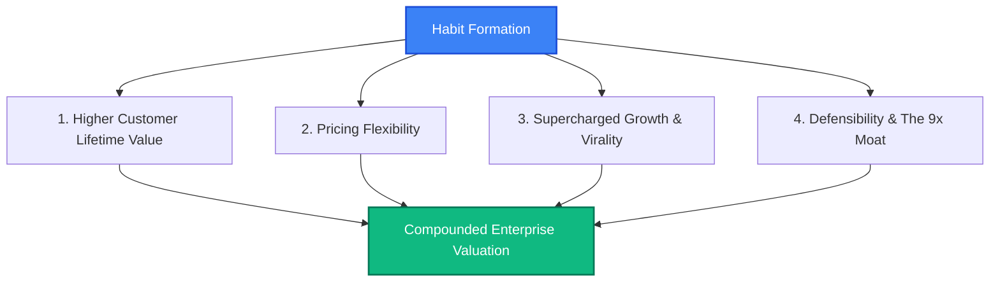
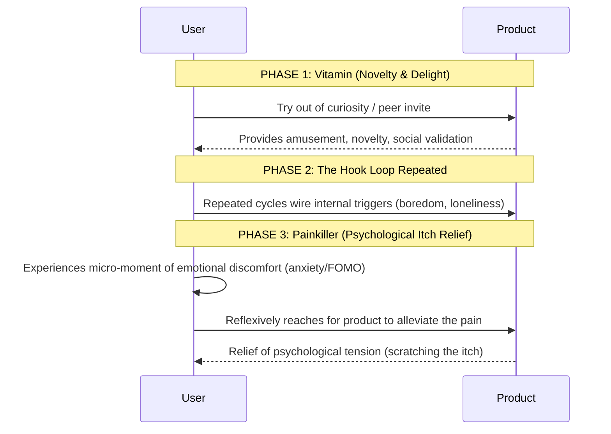
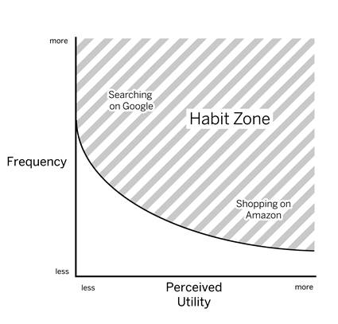

# 01. The Hook Philosophy: The Economics & Strategic Moats of Habit Formation

> *"Habits are defined as behaviors done with little or no conscious thought. The cognitive economy of human decision-making dictates that first-to-mind wins."* — Nir Eyal

---

## The Macroeconomic Shift: Why Habits Rule Technology

Historically, businesses competed on physical access, supply chain efficiency, capital intensity, and massive advertising budgets. In the digital era, access is ubiquitous, distribution costs approach zero, and attention is the rarest commodity on earth. 

When users face near-infinite alternatives, **the company that forms a habit wins by default**. 

Habit-forming products do not rely on expensive, perpetual re-acquisition campaigns or invasive marketing spam. Instead, they attach their internal logic to users' everyday emotional routines. When an individual feels a micro-moment of boredom, social anxiety, uncertainty, or fatigue, they reflexively turn to a specific product without deliberation.

```
Traditional Business Moats            The Habit Moat (Mind Monopoly)
--------------------------            -----------------------------
• Physical shelf space                • Neural automaticity (Basal Ganglia)
• Exclusive distribution contracts    • Reflexive default behavior
• Heavy ad spend (Paid Triggers)      • Internal emotional triggers
• High switching costs from hardware  • Stored value & psychological commitment
```

---

## The Four Business Superpowers of Habits

Nir Eyal outlines four distinct, quantifiable financial advantages that accrue to companies whose products achieve habitual status:



### 1. Increasing Customer Lifetime Value (CLTV)
Customer Lifetime Value is the net profit attributed to the entire future relationship with a customer. In transactional businesses, churn requires continuous paid user re-acquisition. In habit-forming products, customer retention curves flatten out into asymptotic lines. 

Because usage becomes automatic, users remain active for years, dramatically increasing their lifetime revenue contribution while driving marginal acquisition costs toward zero.

### 2. Providing Pricing Flexibility (The Buffett Moat)
Warren Buffett famously remarked:
> *"The single most important decision in evaluating a business is pricing power. If you’ve got the power to raise prices without losing business to a competitor, you’ve got a very good business."*

Habitual users become price-insensitive because evaluating alternatives requires **System 2 deliberate cognitive processing**, which the brain actively seeks to avoid. 

*Case Example: Evernote.* When Evernote moved core features behind a paid paywall, critics predicted mass churn. Instead, users who had integrated Evernote into their daily note-taking, file-saving, and thinking routines paid without hesitation. The cognitive switching cost—relearning a new app, transferring notes, restructuring tags—vastly exceeded the subscription price.

### 3. Supercharging Viral Growth & Shortening the Viral Cycle
Virality is governed by the **Viral Cycle Time**—the amount of time it takes for a user to invite or expose another person to the product.
- If a typical user uses a product once a month, their invitation loop takes 30 days.
- If a user uses a product 20 times a day (like WhatsApp, Instagram, or Slack), the viral loop is compressed into hours or minutes.

Frequent, habitual interaction creates more organic touchpoints, more shared artifacts, and more word-of-mouth recommendations, converting daily active users (DAUs) into unpaid brand evangelists.

### 4. Defensibility: The "9x Effect" and the QWERTY Moat
Why is it nearly impossible to dethrone Google with a marginally better search engine, or replace QWERTY keyboards with the objectively superior Dvorak layout?

Harvard Business School professor John Gourville articulated the **9x Effect**:
- Consumers irrationally overvalue the benefits of their existing habits by a factor of **3x** (Loss Aversion & Endowment Effect).
- Product innovators irrationally overvalue the benefits of their new technology by a factor of **3x**.
- The result is a **9x mismatch**: a new product cannot just be 10% or 20% better; it must be **9x better** to justify breaking an ingrained neural routine.

Ingrained habits create a cognitive fortress. Even if a competitor offers identical or slightly superior features, users will not switch because the effort to unlearn an automatic habit creates psychological friction.

---

## The Concept of the "Mind Monopoly"

A **Mind Monopoly** occurs when a product becomes completely synonymous with a human behavior or cognitive state in the user's subconscious mind:

| Emotional State / Job To Be Done | Reflexive Product Reflex | Mind Monopoly Status |
| :--- | :--- | :--- |
| Need quick information / curiosity | "Google it" | Total Monopoly |
| Micro-moment of boredom | Open Instagram / TikTok / Reddit | High Duopoly |
| Professional identity & credibility | Check LinkedIn | Total Monopoly |
| Fleeting thought or note to preserve | Open Apple Notes / Evernote | Strong Oligopoly |
| Team communication question | Check Slack / Teams | Enterprise Monopoly |

Once a brand achieves Mind Monopoly status, it captures economic rent on human attention.

---

## The Vitamin vs. Painkiller Fallacy

Silicon Valley investors frequently dismiss pitches by asking: *"Is your product a vitamin or a painkiller?"*

```
          TRADITIONAL DICHOTOMY
------------------------------------------
Painkiller : Solves an acute, obvious pain (Aspirin).
             Quantifiable market, immediate ROI.
Vitamin    : "Nice to have", appeals to vanity or entertainment.
             Hard to monetize, high churn.
```

Nir Eyal dismantles this naive binary:
**The most lucrative habit-forming technologies begin as vitamins and transform into painkillers.**



Consider Facebook, Twitter, or Pinterest in their infancy. None of them solved an existential crisis. Nobody lay awake in 2004 thinking, *"I am suffering because I cannot see what my college classmate ate for lunch."* They were pure vitamins.

However, once users spent weeks cycling through the Hook loop, **a new psychological itch was synthesized**:
- Boredom became painful without a feed to scroll.
- Solitude became unbearable without a notification to check.
- Uncertainty became acute without a real-time stream.

The product creates its own psychological need and simultaneously positions itself as the only painkiller capable of soothing it.

---

## The Habit Zone: Frequency vs. Perceived Utility

Can any behavior become a habit? No. A behavior must fall within the **Habit Zone**.


*Figure 2: The Habit Zone — Frequency vs. Perceived Utility.*

```
Perceived
Utility ^
        |       [AMAZON]
   High |      High Utility,
        |    Moderate Frequency
        |           \
        |            *---- Habit Zone Threshold -----
        |                   \
        |                    [GOOGLE / TWITTER]
    Low |                    High Frequency,
        |                    Low/Moderate Utility
        +-------------------------------------------->
       Low                                   High
                        Frequency
```

The Habit Zone is defined by two perpendicular axes:
1. **Frequency**: How often the behavior occurs within a given time frame (times per day, week, or month).
2. **Perceived Utility**: How much conscious benefit, pleasure, or problem-solving value the user gains relative to alternatives.

### The Inviolable Law of Frequency
For an action to cross the **Habit Threshold** and transition from deliberate effort into an automatic routine:
- If Perceived Utility is extraordinarily high (e.g., filing taxes via TurboTax, buying a house, booking an annual vacation), it will rarely become a habit because it happens once a year.
- If Perceived Utility is low or subtle, the behavior **MUST occur with high frequency** (daily or multiple times per week).

> [!WARNING]
> **The Nir Eyal Frequency Rule**: If a digital behavior does not occur at least **once per week**, it is virtually impossible to form a self-sustaining habit. Infrequent behaviors are reset by human cognitive decay, requiring expensive external triggers each time.

---

## Key Ideological Takeaways

1. **Cognitive Default Is Destiny**: Products that achieve automaticity bypass price comparisons, feature matrices, and advertising competition.
2. **Habits Compound Like Capital**: The retention, viral cycle compression, and pricing power of a habit-forming product yield non-linear enterprise valuation.
3. **Manufactured Pain**: Elite products do not wait for external pain; they cultivate subtle psychological friction (the emotional itch) and act as the immediate neural balm.
4. **Frequency Precedes Automaticity**: Do not attempt to build a habit around an infrequent event. If your core value proposition occurs monthly, you must introduce higher-frequency auxiliary hooks to bridge the gap.
