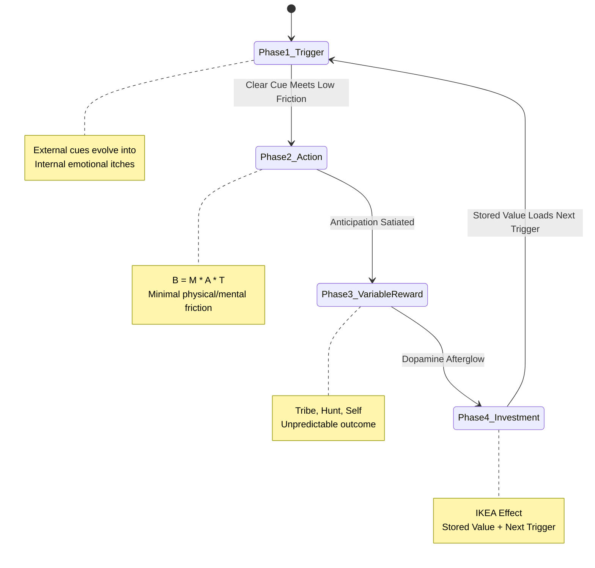
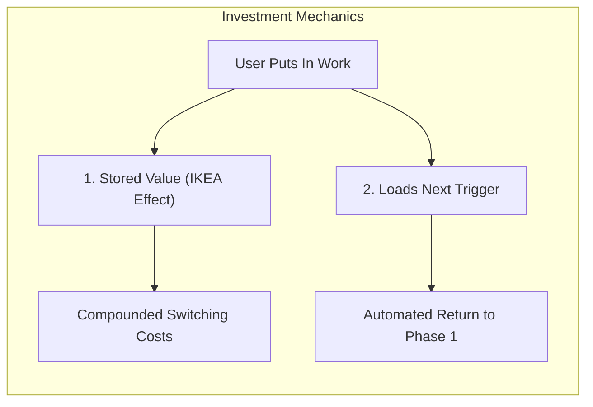

# 03. The Hook Mechanics: Anatomy of the 4-Phase Loop

> *"The Hook Model is an experience designed to connect the user’s problem to the designer’s solution with enough frequency to form a habit."* — Nir Eyal

---

## The System Architecture of the Loop

The Hook Model operates as an iterative feedback engine. Each pass through the four phases strengthens the synaptic association between an emotional problem and a digital solution, gradually eliminating the need for external prompts.



---

## Phase 1: Trigger — The Spark of Behavior

A trigger is the actuator of behavior—the spark plug of the behavioral engine. Triggers inform the user what action to take next. They exist in two sequential categories: **External** and **Internal**.

```
    EXTERNAL TRIGGER                    INTERNAL TRIGGER
(Environmental Information)         (Subconscious Emotional State)
• Push notification                 • "I feel lonely"
• App icon badge                    • "I am bored"
• Email digest                      • "I am uncertain"
• Friend's shared link              • "I fear missing out (FOMO)"
```

### 1. External Triggers: The Scaffolding
External triggers embed information in the user's immediate environment. Nir Eyal categorizes them into four operational types:

| Trigger Type | Mechanism | Economic Cost | Strategic Role |
| :--- | :--- | :--- | :--- |
| **Paid Triggers** | Search engine ads, display ads, sponsored posts. | High ongoing CAC. | Customer acquisition. Unsustainable for long-term retention. |
| **Earned Triggers** | Press mentions, viral videos, App Store features. | High creative effort; unpredictable. | Awareness spikes. Cannot be scheduled or repeated reliably. |
| **Relationship Triggers** | Social invites, word-of-mouth, "Refer a friend" credits. | Low direct cost; requires existing social graph. | Viral hypergrowth. Vulnerable to user burnout if over-spammed. |
| **Owned Triggers** | App icons on home screen, opt-in push notifications, newsletters. | Negligible marginal cost; requires explicit user permission. | **The Core Driver of Habit Formation.** Prompts repeated engagement. |

### 2. Internal Triggers: The Ultimate Destination
While external triggers initiate the loop, **a product has not achieved habit status until it attaches to an internal trigger**.

Internal triggers manifest automatically inside the mind. They are rooted in **negative emotions and psychological discomfort**:
- **Boredom** $\rightarrow$ Reaching for YouTube, Reddit, or TikTok.
- **Loneliness & Social Alienation** $\rightarrow$ Reaching for Instagram or Facebook.
- **Uncertainty & Ignorance** $\rightarrow$ Reaching for Google.
- **Career Anxiety / Insecurity** $\rightarrow$ Reaching for LinkedIn.
- **Workplace Misalignment / Fear of Dropping Balls** $\rightarrow$ Reaching for Slack.

> [!IMPORTANT]
> **The Emotional Itch**: People do not use habit-forming products when they feel fully content, enlightened, and peaceful. They reach for products when they experience a subtle micro-moment of emotional discomfort. The product acts as an instant psychological painkiller.

### Discovering the Internal Trigger: The "5 Whys" Method
Originating from Sakichi Toyoda and the Toyota Production System, Nir Eyal applies the **5 Whys** framework to root-cause psychological research:

```
[Problem]: Why does Julie want an email app on her phone?
├── Why 1? To check work messages while away from her desk.
├── Why 2? Because she wants to stay informed on active projects.
├── Why 3? Because she needs to respond quickly to her colleagues and clients.
├── Why 4? Because she worries that a delay will make her appear incompetent.
└── Why 5 (ROOT INTERNAL TRIGGER): She fears losing her status, job security, and professional respect.
```
*Insight*: Julie’s product need is not "mobile mail syncing"; her internal trigger is **acute professional anxiety**.

---

## Phase 2: Action — The Frictionless Execution

The second phase is **Action**: the singular, minimal behavior performed in anticipation of a reward.

Drawing directly from the Fogg Behavior Model ($B = MAT$), an action requires sufficient Motivation, sufficient Ability, and a Trigger. To maximize action completion, product designers must obsessively optimize **Ability** by eliminating friction across the **Six Elements of Simplicity**:

```
                       THE SIMPLICITY SIEVE
=================================================================
[User Action] ---> [Time Friction]         (Takes > 2 seconds?)
              ---> [Money Friction]        (Requires upfront fee?)
              ---> [Physical Effort]       (Requires typing/clicking?)
              ---> [Brain Cycles]          (Requires hard thinking?)
              ---> [Social Deviance]       (Looks weird to others?)
              ---> [Non-Routine]           (Breaks established habits?)
=================================================================
```

### Case Studies in Radical Simplicity

1. **Google vs. The Web 1.0 Portals**:
   In 1998, Yahoo and Lycos presented dense directories with hundreds of links, stock tickers, and weather modules. Google stripped the entire homepage down to a single text field and two buttons. Cognitive load dropped to zero.

2. **The iPhone Lock Screen Camera Gesture**:
   Taking a photo traditionally required waking the phone, entering a passcode, finding the camera app, launching it, and waiting for the lens. Apple placed a swipe-up camera trigger directly on the locked screen, collapsing the time and physical effort required to capture an ephemeral moment.

3. **Single Sign-On (SSO)**:
   Traditional registration requires 8 form fields, password confirmation, email verification, and captcha solving. "Log in with Facebook/Google" collapses this into a single click, instantly elevating user ability above the action line.

4. **Infinite Scroll (Pinterest / Twitter / TikTok)**:
   Eliminates the "Next Page" button. By removing the cognitive checkpoint where users pause to decide whether to continue, reading becomes a frictionless, continuous stream.

---

## Phase 3: Variable Reward — The Dopamine Engine

Once the action is taken, the user must receive a reward. But a predictable reward extinguishes curiosity. To keep users hooked, the reward must be **variable**.

```
                      THE THREE REWARD DIMENSIONS
========================================================================
1. REWARDS OF THE TRIBE (Social)   --> Connection, Acceptance, Status
2. REWARDS OF THE HUNT  (Material) --> Information, Resources, Cash
3. REWARDS OF THE SELF  (Mastery)  --> Competence, Completion, Autonomy
========================================================================
```

### 1. Rewards of the Tribe (Social Validation)
Driven by our evolutionary need for social belonging, empathy, and peer status:
- **Likes, Retweets, and Comments**: The unpredictable dopamine rush of seeing how many peers validated a shared photo or post.
- **Stack Overflow**: Engineers do not answer programming questions for money; they contribute for upvotes, badges, and peer standing.
- **League of Legends**: Player "Honor" ratings confer visible social status while curbing antisocial behavior.

### 2. Rewards of the Hunt (Resource & Information Seeking)
Driven by the primal human drive to track, forage, and hunt for food and survival resources:
- **The Infinite Feed / Pull-to-Refresh**: The physical motion of pulling down to refresh an app (Twitter, Instagram, Reddit) mimics the mechanical lever of a Las Vegas slot machine. The user never knows if the next item will be a mundane advertisement or a captivating viral video.
- **Pinterest Board Browsing**: Searching for the next stunning visual idea or DIY project.

### 3. Rewards of the Self (Mastery & Completion)
Driven by intrinsic human motivation for self-efficacy, order, and competence:
- **Inbox Zero**: The obsessive desire to archive emails to reach a clean, empty state.
- **Leveling Up in Video Games**: Conquering a difficult level in *Angry Birds* or *Candy Crush*.
- **Codecademy**: Checking off code exercises with immediate green checkmarks.

### Finite vs. Infinite Variability

```
FINITE VARIABILITY                         INFINITE VARIABILITY
------------------                         --------------------
• Fixed content arcs (Linear games)        • User-Generated Content (TikTok, YouTube)
• Predictable storylines (Single movies)   • Dynamic Social Feeds (Twitter, Reddit)
• Tamagotchi / Farmville chores            • Competitive Multiplayer (Chess, LoL)
------------------                         --------------------
Result: Eventual Satiation & Churn         Result: Eternal Novelty & Compulsion
```

Products built solely on **finite variability** (e.g., Zynga's *Farmville*, *Trivia Crack*) eventually experience catastrophic engagement collapses once users decode the underlying pattern. Long-term habit-forming platforms rely on **infinite variability**—systems powered by user-generated content, algorithmic discovery, or peer interaction that continuously surface unexpected novelty.

### The Autonomy Guardrail: Psychological Reactance
If users feel tricked, trapped, or coerced by variable reward mechanics, they experience **psychological reactance**—an intense motivation to regain freedom by rejecting the product entirely. Variable rewards must feel like a natural byproduct of user choice, not an oppressive manipulative trap.

---

## Phase 4: Investment — Storing Value & Pre-Loading the Next Trigger

The final, and most frequently neglected, phase of the Hook Model is **Investment**.

```
Action Phase                        Investment Phase
------------                        ----------------
• Immediate gratification           • Delayed future payoff
• Minimum effort (B=MAT)            • Measurable effort / work
• Satiates current craving          • Sets up the next cycle
```

The user must put a "bit of work" into the product. This work accomplishes two crucial behavioral objectives:
1. It creates **Stored Value** that makes the product objectively and subjectively better with use.
2. It **Loads the Next Trigger**, automatically firing a future cue.



### The 5 Types of Stored Value

1. **Content**:
   Every playlist curated on Spotify, document written in Google Docs, or photo uploaded to Instagram deepens the user's personal archive. Abandoning the platform means forfeiting an irreplaceable collection.
2. **Data**:
   Mint tracks financial spending patterns; Strava archives running routes and split times. The more data logged, the more personalized and indispensable the algorithm becomes.
3. **Followers**:
   Building an audience on Twitter, YouTube, or Substack creates personal distribution and social capital. Users cannot migrate their followers to a competing service, creating total lock-in.
4. **Reputation**:
   A 5-star seller rating on eBay, Superhost status on Airbnb, or top karma on Reddit cannot be exported. Leaving the service wipes out years of earned social credibility.
5. **Skill**:
   Mastering complex interfaces (Photoshop keyboard shortcuts, Vim commands, Salesforce pipelines) represents hundreds of hours of procedural learning. Switching to a competitor resets the user back to novice status.

### Loading the Next Trigger: The Mechanical Hand-off
The most elegant habit loops use the Investment phase to program the next external trigger:
- **WhatsApp / iMessage**: Sending a message (investment) requires the recipient to reply, which automatically delivers a push notification (the next external trigger) to the sender.
- **Tinder**: Swiping on profiles (investment) sets up a match alert notification when the other party reciprocates.
- **Any.do**: Adding a task (investment) allows the app to ping the user with a scheduled reminder when the meeting concludes.

The cycle is closed. The user is hooked.
