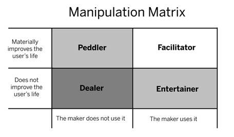

# 04. The Manipulation Matrix: The Ethics of Behavioral Engineering

> *"Building habit-forming products is a form of mind control. With this superpower comes profound moral responsibility."* — Nir Eyal

---

## The Moral Burden of Behavioral Architecture

Architects who design physical buildings understand that the placement of stairs, doorways, and windows dictates human traffic, safety, and fire evacuation speeds. Digital product designers hold an even more insidious power: **they design the cognitive architecture of human attention**.

By manipulating external triggers, simplifying behavioral thresholds, and injecting variable dopamine bursts, software creators alter subconscious human behavior across millions of people simultaneously. 

Because behavioral engineering can be weaponized to exploit cognitive vulnerabilities, Nir Eyal asserts that every creator must confront the morality of manipulation.

---

## Habit vs. Addiction: The Line of Harm

Before evaluating the ethics of a product, designers must draw a strict boundary between a **habit** and an **addiction**:

```
+-------------------------------------------------------------------------+
|                                 HABIT                                   |
|   An automatic behavior done with little or no conscious thought that   |
|         yields neutral or positive utility to the user's life.          |
+-------------------------------------------------------------------------+
                                    vs.
+-------------------------------------------------------------------------+
|                               ADDICTION                                 |
|     A compulsive, self-destructive dependency on a behavior or         |
|      substance that materially harms a person's physical health,        |
|             mental well-being, finances, or relationships.              |
+-------------------------------------------------------------------------+
```

A habit enriches or streamlines daily existence (e.g., automatically tracking runs on Strava, learning languages on Duolingo, reading daily reflections). An addiction actively degrades human autonomy and dignity (e.g., compulsive gambling, pathological gaming that destroys sleep and family life, compulsive social media doom-scrolling).

> [!CAUTION]
> **The Designer's Responsibility**: While true clinical addiction affects a minority of users (typically 1% to 5% with pre-existing biological or psychological vulnerabilities), designers cannot wash their hands of the damage. Creators have an ethical imperative to identify, monitor, and assist pathological users.

---

## The Manipulation Matrix

To help entrepreneurs, product managers, and engineers evaluate their ethical positioning, Nir Eyal formulated **The Manipulation Matrix**—a 2x2 decision framework based on two fundamental moral inquiries:

1. **"Would I use the product myself?"** (Authenticity & Skin in the Game)
2. **"Does the product materially improve the user's life?"** (External Utility & Human Flourishing)


*Figure 3: The Manipulation Matrix — Evaluating the Maker's Intent.*

```
             Does the product materially improve the user's life?
                              YES                     NO
                     +---------------------+---------------------+
                 YES |   THE FACILITATOR   |   THE ENTERTAINER   |
Would I use the      | (Highest Integrity) |  (Ephemeral Fun)    |
product myself?      +---------------------+---------------------+
                  NO |     THE PEDDLER     |     THE DEALER      |
                     |  (Paternalistic)    |   (Exploitative)    |
                     +---------------------+---------------------+
```

---

## Deep Breakdown of the Four Quadrants

### 1. The Facilitator (Uses it? YES | Improves life? YES)
The Facilitator represents the pinnacle of ethical behavioral design. 
- **The Dynamic**: The creator builds a product they genuinely rely on, which meaningfully enhances health, knowledge, financial independence, or human connection.
- **Why Facilitators Win**: Facilitators operate with unparalleled empathy. Because they are their own primary user, they intuitively know where the user experiences friction, when a notification feels spammy, and what kind of reward is genuinely fulfilling.
- *Examples*: Founders of Strava, Duolingo, Khan Academy, Any.do, or YouVersion.

### 2. The Peddler (Uses it? NO | Improves life? YES)
The Peddler creates a product that claims to improve users' lives, but the creator does not personally use it.
- **The Dynamic**: Often found in public health initiatives, enterprise software sold to underlings, or charitable tech projects designed for "those less fortunate."
- **The Peril of the Peddler**: Peddlers suffer from **hubris and lack of empathy**. They view users as subjects to be conditioned rather than peers to be served. As a consequence, peddled products frequently fail because the creator cannot feel the awkwardness or friction of the user experience.
- *Verdict*: Morally well-intentioned, but structurally vulnerable to failure and condescension.

### 3. The Entertainer (Uses it? YES | Improves life? NO)
The Entertainer creates art, casual gaming, or pure amusement.
- **The Dynamic**: The creator enjoys playing their own game or watching their own media, but recognizes that it does not fundamentally transform human health, intellect, or economic standing.
- **The Peril of the Entertainer**: Entertainment relies on **finite variability**. Jokes get old, game levels get solved, and visual novelties lose their luster. The Entertainer is strapped to an endless treadmill of producing new hits (the Hollywood / mobile gaming studio dilemma).
- *Examples*: Rovio (*Angry Birds*), King (*Candy Crush*), casual mobile game developers.
- *Verdict*: Honest and enjoyable, but rarely produces durable, generational enterprise moats without continuous content treadmill investments.

### 4. The Dealer (Uses it? NO | Improves life? NO)
The Dealer creates habit loops they would never let themselves or their own children touch, knowing the product extracts value without improving user welfare.
- **The Dynamic**: Pure predatory exploitation. The dealer builds addiction machines to harvest attention, money, or personal data.
- **The Pathology**: The dealer rationalizes their work through cynical detachment: *"If I don't build it, someone else will,"* or *"Caveat emptor—let the buyer beware."*
- *Examples*: High-frequency online gambling casinos, predatory free-to-play pay-to-win game loops targeted at minors, black-hat clickbait ad networks, and deepfake engagement farms.
- *Verdict*: **Morally indefensible.** Building as a Dealer corrodes the soul of the engineer and leaves a wake of human wreckage.

---

## Beyond the Matrix: Modern Guardrails for Responsible Design

In the decades following the publication of *Hooked*, the tech industry has grappled with the fallout of unregulated behavioral loops: mental health crises among teens, fractured attention spans, and social polarization. 

To practice ethical behavioral design today, teams must adopt **Operational Guardrails**:

```
                       RESPONSIBLE DESIGN PROTOCOL
========================================================================
1. THE REGRET TEST
   "If users knew everything the designer knows about how this product
    works, would they still willingly use it?"

2. THE "USE AND SHUT" COVENANT
   Does the product help users accomplish their goals and get on with
   their lives, or does it trap them in mindless zombie scrolling?

3. ADDICTION DETECTION & SELF-EXCLUSION
   Does the platform actively monitor extreme usage (e.g., top 1% outliers
   using > 8 hours/day) and provide automated circuit breakers, usage limits,
   or outreach?

4. TRANSPARENT VARIABLE REWARD ENGINE
   Are algorithms designed to maximize user value, or strictly engineered
   to maximize ad impressions at the expense of user psychological safety?
========================================================================
```

### The Ultimate Test of Integrity
Nir Eyal closes the moral inquiry with a personal standard for every builder:
> *"Never build something you would not feel proud to have your own children or loved ones spend their precious time using."*
