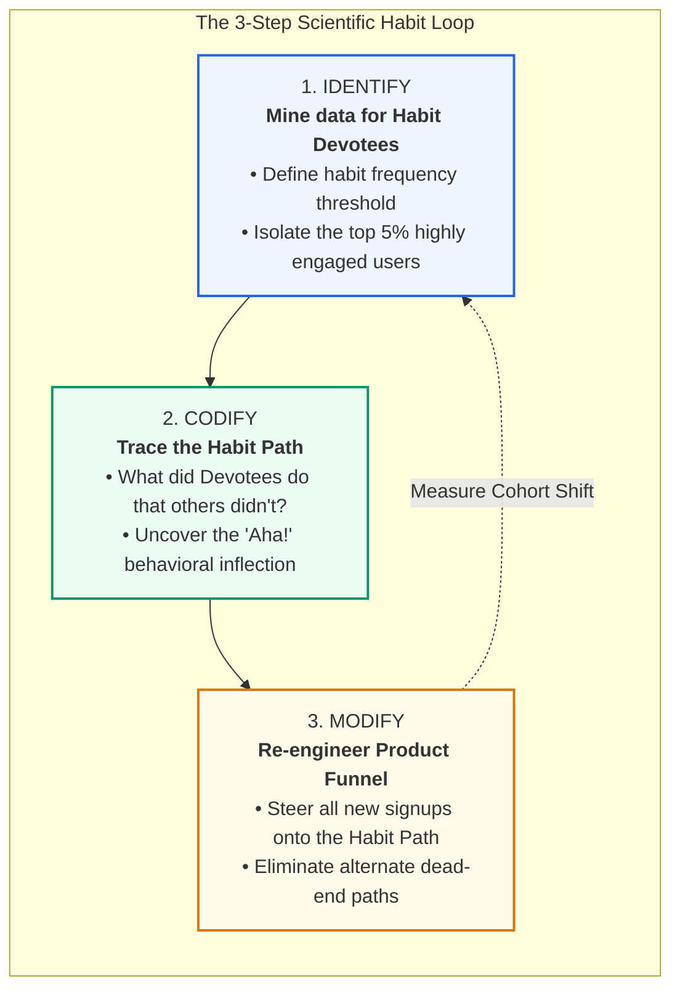

# 05. The Builder's Playbook: Habit Testing & Practical Implementation

> *"To build a habit-forming product, you must continuously test your assumptions against reality. You must Identify your habitual users, Codify their behavior, and Modify the product to nudge everyone else down the same path."* — Nir Eyal

---

## The 5 Core Hook Diagnostic Questions

Before writing code or designing user interfaces, product teams must stress-test their value proposition against the **Five Core Hook Questions**:

```
+========================================================================================+
|                              THE HOOK DIAGNOSTIC SUITE                                 |
+========================================================================================+
| 1. INTERNAL TRIGGER   | What pain, discomfort, or emotional itch is the user easing?  |
|                       | (Boredom, loneliness, doubt, fear, fatigue, FOMO)              |
+-----------------------+----------------------------------------------------------------+
| 2. EXTERNAL TRIGGER   | What specific sensory cue brings the user to the product?       |
|                       | (Push notification, email, app icon, friend's message)         |
+-----------------------+----------------------------------------------------------------+
| 3. ACTION             | What is the simplest possible behavior done for reward?        |
|                       | How can friction be cut across Time, Money, Effort, & Thought? |
+-----------------------+----------------------------------------------------------------+
| 4. VARIABLE REWARD    | Is the user rewarded, yet left hungry for more?                |
|                       | Does the reward tap into Tribe, Hunt, or Self? Infinite?       |
+-----------------------+----------------------------------------------------------------+
| 5. INVESTMENT         | What bit of work does the user invest?                         |
|                       | Does it store value (data, content, rep) and load the trigger? |
+========================================================================================+
```

---

## The 3-Step Habit Testing Methodology

How do you know if your product is habit-forming? Nir Eyal outlines a rigorous scientific framework: **Habit Testing**.



### Step 1: Identify (Isolate the Habit Devotees)
1. **Define the Habit Baseline**: Determine how frequently a habitual user *should* realistically interact with your service.
   - For social, messaging, or news: Multiple times per day.
   - For productivity, project management: Daily on workdays.
   - For accounting or expense reporting: Once per week.
2. **Calculate the Devotee Percentage**: Query your cohort retention data:
   $$\text{Devotee Ratio} = \frac{\text{Users meeting habit frequency threshold}}{\text{Total Active User Base}}$$
3. **The Rule of Thumb**: If at least **5% of your active users** exhibit compulsive, unprompted daily usage, your product possesses the genetic code of a habit-forming product. If 0% do, your core value proposition lacks habit-forming potential.

### Step 2: Codify (Uncover the "Habit Path")
Once the Devotees are isolated, study their behavioral audit logs to discover the **Habit Path**—the exact sequence of actions that transformed them from curious trial users into hooked evangelists:
- *Twitter's Historic Discovery*: Early Twitter believed users wanted to tweet. Data revealed that users who churned wrote 0 tweets, while users who became hooked followed at least **30 accounts** during onboarding (including top media personalities). Twitter codified the Habit Path: *Following users $\rightarrow$ feed consumption $\rightarrow$ habit formation*.
- *Facebook's North Star Metric*: Chamath Palihapitiya’s growth team discovered that getting a new user to **7 friends in 10 days** was the singular inflection point for permanent retention.

### Step 3: Modify (Re-engineer the Funnel)
Redesign the user experience to eliminate all distractions and force every new registrant down the codified Habit Path:
- Eliminate extraneous setup screens.
- Auto-suggest high-quality accounts or content.
- Restructure the UI so the high-leverage action is the path of least resistance.

---

## Where to Discover Habit-Forming Opportunities

Entrepreneurs and product innovators do not need to invent new human desires; they need to identify where existing desires can be satisfied with radically lower friction. Nir Eyal highlights three fertile hunting grounds:

```
               OPPORTUNITY DISCOVERY TRIAD
=========================================================
1. NASCENT BEHAVIORS   --> What are subcultures doing?
2. ENABLING TECH       --> What historic friction died?
3. INTERFACE SHIFTS    --> How did human input change?
=========================================================
```

### 1. Nascent Behaviors (The Subculture Signal)
Observe what weird, obsessive, or passionate subcultures are doing before it becomes mainstream.
- *Evan Spiegel (Snapchat)*: Observed teenagers taking disposable photos and deleting them to avoid permanent digital footprints. What parents viewed as teenage vanity was actually a nascent human behavior: ephemeral communication without reputational permanence.
- *Caterina Fake & Stewart Butterfield (Flickr)*: Observed massively multiplayer online game players obsessively sharing and archiving game screenshots, which birthed modern photo-sharing.

### 2. Enabling Technologies (Eliminating Physical Friction)
Whenever a breakthrough technology emerges (smartphones, GPS, cloud compute, high-speed mobile networks, LLMs/AI), it obliterates historic constraints:
- *Uber*: GPS location APIs + ubiquitous 4G smartphones eliminated the friction of hailing a taxi or calling dispatch.
- *Instagram*: High-resolution smartphone cameras + built-in photo processing chips turned every user into a photographer.

### 3. Interface Changes (Collapsing the Action Threshold)
Shifts in how humans interact with software create immediate opportunities to re-hook users:
- Desktop Mouse/Keyboard $\rightarrow$ Smartphone Multi-Touch $\rightarrow$ Voice Interfaces $\rightarrow$ Multimodal AI Agents.
- Every interface paradigm shift slashes **Brain Cycles** and **Physical Effort**, enabling new behaviors to cross Fogg's Action Line ($B = MAT$).

---

## The Friction Audit Checklist

When diagnosing a low-converting user step, audit it against Fogg's Six Elements of Simplicity:

| Simplicity Dimension | Diagnostic Question | Friction Reduction Fix |
| :--- | :--- | :--- |
| **1. Time** | Does this step take more than 5 seconds? | Use autofill, predictive text, 1-click execution. |
| **2. Money** | Does this step require credit card input upfront? | Offer a frictionless freemium tier or delayed payment. |
| **3. Physical Effort** | Does the user have to type on a keyboard? | Replace typing with taps, toggles, swipes, or voice. |
| **4. Brain Cycles** | Does the user have to read paragraphs or choose from >4 options? | Apply Hick’s Law: present a single, opinionated default. |
| **5. Social Deviance** | Does this action make the user feel exposed or judged? | Normalize the behavior through social proof and private defaults. |
| **6. Non-Routine** | Does this action conflict with their existing daily habits? | Anchor the new behavior directly to an established anchor routine. |
