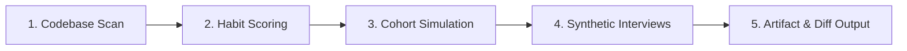

# Hook Model Behavioral Audit & Simulation Skill

Audits a software project, codebase, PRD, or user flow against **Nir Eyal's Hook Model** (*Hooked: How to Build Habit-Forming Products*). Diagnoses why users drop off, measures friction across the **6 Elements of Simplicity**, simulates 30-day cohort retention, interrogates synthetic churned users with the **5 Whys**, and generates actionable code/copy remediation diffs.

---

## Operating Procedure

When asked to audit a project or run a Hook Model analysis:



### Step 1: Scan Target Project
Run the deterministic AST and pattern scanner to identify Hook components (triggers, actions, variable rewards, investments, and friction points):

```bash
python3 -m hook_engine scan "<target-path>"
```

### Step 2: Score Behavioral Metrics & The Habit Zone
Evaluate the project against Nir Eyal's quantitative frameworks:
- **Habit Zone Coordinate**: Maps Frequency vs. Perceived Utility (Painkiller vs. Vitamin).
- **Fogg Simplicity Sieve ($B = MAT$)**: Scores friction across Time, Money, Effort, and Mental Load.
- **Reward Entropy**: Checks whether variable rewards are infinite (sustainable) or finite (dopamine burnout).
- **Manipulation Matrix**: Verifies ethical positioning (Facilitator vs. Dealer).

### Step 3: Run Multi-Agent Cohort Simulation (Day 0 to Day 30)
Simulates five realistic user archetypes (Casual Novice, Anxious Pro, Cynic, Power Devotee, Busy Multitasker) progressing through the 4 phases over 30 days:

```bash
python3 -m hook_engine simulate "<target-path>"
```

### Step 4: Interrogate Churned Users ("5 Whys")
For cohorts that experience high attrition, conduct autonomous qualitative "5 Whys" root-cause interviews to uncover the exact cognitive or emotional friction that killed the habit loop.

### Step 5: Render Deliverables
Generate a versioned JSON bundle, a standalone interactive HTML dashboard, and unified git diffs:

```bash
python3 -m hook_engine audit "<target-path>" --html report.html --json bundle.json --diff
```

---

## Lazy-Loaded Reference Guides

*Read these on demand from `references/` when evaluating specific phases to preserve context window:*

| Phase | Reference Guide | Key Topics |
| :--- | :--- | :--- |
| **Zone** | `references/01_habit_zone.md` | LTV, Pricing Power, 9x Effect, Habit Zone thresholds |
| **1. Trigger** | `references/02_trigger_rubric.md` | Paid/Earned/Rel/Owned triggers, Internal emotional itches, 5 Whys |
| **2. Action** | `references/03_action_fogg_sieves.md` | $B=MAT$, 6 Simplicity Levers, Scarcity, Framing, Endowed Progress |
| **3. Reward** | `references/04_variable_rewards.md` | Tribe, Hunt, Self; Finite vs. Infinite variability; Dopamine |
| **4. Investment** | `references/05_stored_value_types.md` | IKEA effect; 5 Stored Value types; Priming the next trigger |
| **5. Ethics** | `references/06_manipulation_matrix.md` | Facilitator, Peddler, Entertainer, Dealer; Dark patterns & Sludge |
| **6. Playbook** | `references/07_builder_playbook.md` | 5 Core Questions; Identify-Codify-Modify habit testing |

---

## Required Output Schema

Every complete audit must output:
1. **Executive Habit Health Score** (0 - 100) and Habit Zone coordinate ($x, y$).
2. **The 4 Hook Phases Scorecard** with Pass/Warn/Fail verdicts.
3. **Cohort Retention Waterfall** showing Day 0 to Day 30 survival.
4. **Synthetic Churn Interview Transcript** with the 5 Whys.
5. **Actionable Remediation Diffs** (copy revisions and UI simplification).
