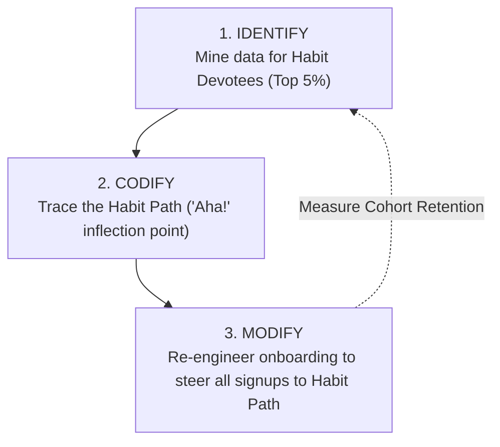

# Reference 07: The Builder's Playbook & Habit Testing

> *"To build a habit-forming product, you must continuously test your assumptions against reality: Identify your habitual users, Codify their behavior, and Modify the product to nudge everyone else down that path."* — Nir Eyal

---

## 1. The 5 Core Hook Diagnostic Questions

Before building or refactoring, every product team must answer:

1. **Internal Trigger**: What pain, discomfort, or emotional itch is the user seeking to soothe?
2. **External Trigger**: What specific sensory cue brings the user to the product?
3. **Action**: What is the simplest possible behavior performed in anticipation of reward?
4. **Variable Reward**: Is the user rewarded, yet left wanting more?
5. **Investment**: What bit of stored value did the user invest that primes the next trigger?

---

## 2. The 3-Step Habit Testing Methodology

### Step 1: Identify (Isolate Devotees)
* Define habit baseline frequency (e.g. daily for social/work, weekly for analytics).
* Identify users who reach this threshold unprompted.
* **Benchmark Rule**: If $\ge 5\%$ of total active users exhibit unprompted daily usage, your product has the DNA of a habit-forming product. If 0% do, your value proposition lacks habit viability.

### Step 2: Codify (Discover the Habit Path)
* What specific sequence of actions did Devotees complete that churned users did not?
* *Twitter's Discovery*: Churned users wrote 0 tweets; Devotees followed 30 accounts during onboarding.
* *Facebook's North Star*: Getting to 7 friends in 10 days was the inflection point for lifetime retention.

### Step 3: Modify (Re-engineer the Funnel)
* Eliminate extraneous setup screens that distract from the Habit Path.
* Auto-suggest high-leverage actions (e.g. recommend 10 people to follow).
* Make the codified Habit Path the path of least resistance.

---

## 3. The Opportunity Discovery Triad

1. **Nascent Behaviors**: What are passionate subcultures doing that mainstream people will do tomorrow? (e.g. Snapchat ephemeral photos).
2. **Enabling Technologies**: What new technology eliminated historic friction? (e.g. Uber using GPS + 4G smartphones).
3. **Interface Shifts**: How did the physical input mechanism change? (e.g. desktop mouse $\rightarrow$ touch screen swipe $\rightarrow$ voice/AI conversational prompt).
